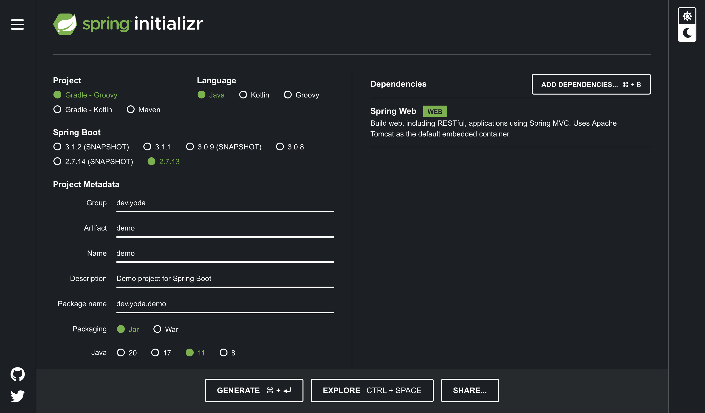

## 1. Basics

**Java 언어를 컴퓨터가 이해하는 언어(기계어)로 바꿔줘야 한다.**

- JVM(Java Virtual Machine)
  - 자바와 기계어 사이의 중간 단계인 Java Bytecode를 기계어로서 컴퓨터에 전달
- JRE(Java Runtime Environment)
  - JVM과, JVM이 사용할 수 있는 다른 기타 라이브러리 등을 포함
- JDK(Java Development Kit)
  - 자바 언어를 사용해서 개발을 할 때 필요한 것들을 모아둔 키트
  - = 자바 코드를 Java Bytecode로 만드는 과정(컴파일) + JRE

 

**Code Editor와 IDE**

- Java 코드를 효율적으로 작성하기 위한 도구
- Code Editor: 프로그래밍 언어에 따라 문법 검증 및 편집 편의성 제공
- IDE: 사용하는 언어 및 프레임워크에 따라 다양한 기능 제공

 

**Docker**

- 컨테이너 개념을 활용한 가상화 기술의 일종
- OS 위에 컨테이너를 올려 어플리케이션을 활용
- 이전의 가상화 기술에 비하여 훨씬 가벼움
- 웹 어플리케이션 개발에 필요한 다양한 소프트웨어의 설치를 간소화 해줌
- 명령어들
  - `docker`: Docker Daemon에 요청을 보낸다.
  - `run`: 컨테이너를 실행한다.
  - `-d`: Detached, 컨테이너를 background에서 실행하는 옵션
  - `-p`: Port, 컨테이너의 포트를 물리 서버의 포트와 연결한다.
  - `docker/getting-started`: 컨테이너로 실행할 이미지의 이름
  - ex) 새로운 어플리케이션을 docker로 실행하기 
  - `docker run -d -p 80:80 docker/getting-started` (간단한 이미지를 받고 실행하기) -> `http://127.0.0.1:80 접속`

 

**Client - Server Model**

- HTML, CSS, JS
  - 인터넷 브라우저가 사용하는 기술이다.
  - `HTML`: 브라우저에 표시될 내용을 기술하는 언어
  - `CSS`: 표현되는 형식을 정의하는 언어
  - `JS`: 브라우저에 동작을 제공하는 언어
- Frontend와 Backend
  - Frontend 개발자: 브라우저에 보이는 것을 중점으로 공부하는 개발자
  - Backend 개발자: 상황에 맞는 로직과 데이터를 다루는 개발자
- Client - Server Model
  - 인터넷: 원격으로 연결된 수많은 컴퓨터들이 이루는 네트워크
  - 인터넷 브라우저는 서버에 특정한 요청을 보내고 결과를 돌려받는다.
  - => 서버 프로세스와 클라이언트 프로세스는 분리가 되어 있다.
  - 하나의 프로세스에서 또다른 프로세스로 요청과 응답을 주고 받는 형태를 띄는 어플리케이션을 말한다.
  - 이때, Spring boot는 서버 프로세스에 해당한다.
- Spring boot
  - (Web) Application Framework
  - Http 요청 등을 받으면, 요청에 따른 응답을 돌려주는 Web Application을 만드는 Framework

 

**Spring Boot Initializr**

- https://start.spring.io

  

