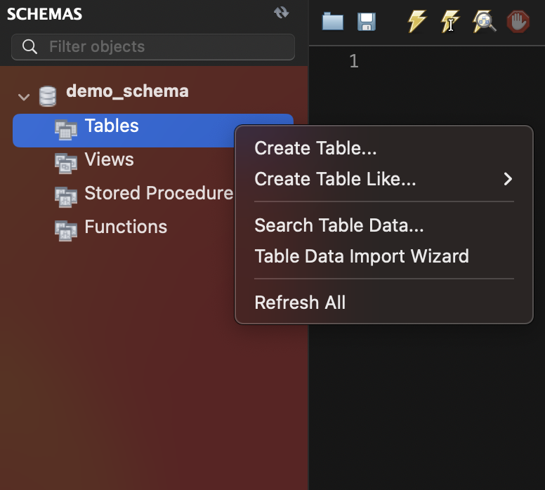

## 4. CRUD & Data (1)

<br>

### 1. CRUD란?

**웹 서비스란?**

- 사용자가 원하는 자원의 관리
- 자원 제공, 제작, 갱신 등
- 부수적인 기능은 서비스 별로 다르게 만들어진다.

<br>

**CRUD**

- 어떤 자원을 사용자에게 제공할 때, 사용할 수 있는 4가지 인터페이스(기능)
- Create - 생성
- Read - 조회
- Update - 갱신
- Delete - 삭제

<br>

- 프로젝트 생성

  

- PostDto

- `post/PostDto`

  ```java
  package dev.yoda.crud.post;
  
  public class PostDto {
      private String title;
      private String content;
      private String writer;
  
      public PostDto() {
      }
  
      public PostDto(String title, String content, String writer) {
          this.title = title;
          this.content = content;
          this.writer = writer;
      }
  
      public String getTitle() {
          return title;
      }
  
      public void setTitle(String title) {
          this.title = title;
      }
  
      public String getContent() {
          return content;
      }
  
      public void setContent(String content) {
          this.content = content;
      }
  
      public String getWriter() {
          return writer;
      }
  
      public void setWriter(String writer) {
          this.writer = writer;
      }
  
      @Override
      public String toString() {
          return "PostDto{" +
                  "title='" + title + '\'' +
                  ", content='" + content + '\'' +
                  ", writer='" + writer + '\'' +
                  '}';
      }
  }

<br>

- **CREATE**

- `post/PostController`

  ```java
  package dev.yoda.crud.post;
  
  import org.slf4j.Logger;
  import org.slf4j.LoggerFactory;
  import org.springframework.stereotype.Controller;
  import org.springframework.web.bind.annotation.PostMapping;
  import org.springframework.web.bind.annotation.RequestBody;
  import org.springframework.web.bind.annotation.RequestMapping;
  import org.springframework.web.bind.annotation.ResponseBody;
  
  import java.util.ArrayList;
  import java.util.List;
  
  @Controller
  @ResponseBody
  @RequestMapping("post")
  public class PostController {
      private static final Logger logger = LoggerFactory.getLogger(PostController.class);
      private final List<PostDto> postList;
  
      public PostController() {
          postList = new ArrayList<>();
      }
  
      @PostMapping("create")
      public void createPost(@RequestBody PostDto postDto) {
          logger.info(postDto.toString());
          this.postList.add(postDto);
      }
  }
  ```

- 포스트맨으로 테스팅하기

  

<br>

- **READ**

- `post/PostController`

  ```java
  package dev.yoda.crud.post;
  
  import org.slf4j.Logger;
  import org.slf4j.LoggerFactory;
  import org.springframework.stereotype.Controller;
  import org.springframework.web.bind.annotation.*;
  
  import java.util.ArrayList;
  import java.util.List;
  
  @Controller
  @ResponseBody
  @RequestMapping("post")
  public class PostController {
      ...
  
      @GetMapping("read-all")
      public List<PostDto> readPostAll() {
          logger.info("in read all");
          return this.postList;
      }
  
      @GetMapping("read-one")
      public PostDto readPostOne(@RequestParam("id") int id) {
          logger.info("in read one");
          return this.postList.get(id);
      }
  }
  
  ```

- 포스트맨으로 테스팅하기 (read-all, read-one)

  

- 

<br>

- **UPDATE**

- `post/PostController`

  ```java
  package dev.yoda.crud.post;
  
  import org.slf4j.Logger;
  import org.slf4j.LoggerFactory;
  import org.springframework.stereotype.Controller;
  import org.springframework.web.bind.annotation.*;
  
  import java.util.ArrayList;
  import java.util.List;
  
  @Controller
  @ResponseBody
  @RequestMapping("post")
  public class PostController {
      ...
  
      @PostMapping("update")
      public void updatePost(
              @RequestParam("id") int id,
              @RequestBody PostDto postDto
      ) {
          PostDto targetPost = this.postList.get(id);
          if(postDto.getTitle() != null) {
              targetPost.setTitle(postDto.getTitle());
          }
          if(postDto.getContent() != null) {
              targetPost.setContent(postDto.getContent());
          }
          this.postList.set(id, targetPost);
      }
  }
  
  ```

- 포스트맨으로 테스팅하기

  

  

<br>

- **DELETE**

- `post/PostController`

  ```java
  package dev.yoda.crud.post;
  
  import org.slf4j.Logger;
  import org.slf4j.LoggerFactory;
  import org.springframework.stereotype.Controller;
  import org.springframework.web.bind.annotation.*;
  
  import java.util.ArrayList;
  import java.util.List;
  
  @Controller
  @ResponseBody
  @RequestMapping("post")
  public class PostController {
      ...
  
      @DeleteMapping("delete")
      public void deletePost(@RequestParam("id") int id) {
          this.postList.remove(id);
      }
  }
  
  ```

- 포스트맨으로 테스팅하기

  

  

<br>

=> 위와 같은 방식들은 좋은 형태는 아니다!

<br>

### 2. CRUD와 REST

**RESTful이란?**

- REpresentational / State / Transfer
- Client와 Server 간의 결합성을 줄이기 위한 가이드
- 즉, Client와 Server 중 어느 한 쪽이 변화하는 것이 상대방에 큰 영향을 끼치지 않도록 한다.
- Client가 사용할 api를 누가 사용해도 큰 문제 없이 사용하게끔 한다.

<br>

**API를 RESTful하게 설계하는 방법**

1. Client Server Architecture
   - 서버와 클라이언트는 서로 잘 분리되어 있어야 한다.
   - 서로의 변화가 서로에게 영향을 주지 않는 형태가 되어야 한다.
2. Statelessness
   - 상태를 가지고 있지 않아야 한다.
   - server 안에 사용자 정보를 기록하지 않는다.
   - 모든 요청은 독립적이어서 요청을 보낸 당사자가 자신이 누구인지 증명할 책임을 가지고 있어야 한다.
   - 원하는 기능을 위한 상태는 client가 가지고 있어야 한다.
3. Cacheability
   - 캐시 가능성을 나타낸다.
   - 수많은 client들은 server에 있던 자원을 본인의 컴퓨터에 저장하는 캐싱 기능을 가지는데, server는 자원의 캐싱이 가능한지의 여부를 항상 표기해줘야 한다.
4. Layered System
   - 계층적인 구조를 가진다.
   - client는 server에 도달하기까지의 과정을 알 필요가 없다.
5. Uniformed Interface
   - 일관된 인터페이스를 가진다.
   - 자원을 나타내기 위해서 사용해야하는 인터페이스를 말한다.
6. Code on Demand (Optional)
   - 사용 가능한 코드를 응답으로 보내, 사용자의 기능을 일시적으로 확장시킬 수 있다.

<br>

**URL & HTTP 요청**

1. 경로(Path)를 통해 도달하고자 하는 자원을 지정
2. 방법(Method)을 통해 자원에 실행할 기능을 지정

<br>

**RestController로 CRUD**

- `post/PostRestController`

- PostController의 RequestMapping 경로를 주석처리하고 작성

  ```java
  package dev.yoda.crud.post;
  
  import org.slf4j.Logger;
  import org.slf4j.LoggerFactory;
  import org.springframework.web.bind.annotation.*;
  
  import java.util.ArrayList;
  import java.util.List;
  
  @RestController
  @RequestMapping("post")
  public class PostRestController {
      private static final Logger logger = LoggerFactory.getLogger(PostRestController.class);
      private final List<PostDto> postList;
  
      public PostRestController() {
          this.postList = new ArrayList<>();
      }
  
      //http://localhost:8080/post
      //POST /post
      //REQUEST_BODY
      @PostMapping
      public void createPost(@RequestBody PostDto postDto) {
          logger.info(postDto.toString());
          this.postList.add(postDto);
      }
  
      //http://localhost:8080/post
      //GET /post
      @GetMapping
      public List<PostDto> readPostAll() {
          logger.info("in read post all");
          return this.postList;
      }
  
      //http://localhost:8080/post?id=0
      //GET /post/0
      @GetMapping("{id}")
      public PostDto readPost(@PathVariable("id") int id) {
          logger.info("in read post");
          return this.postList.get(id);
      }
  
      //@PutMapping: 현재 보내는 데이터를 그 위치에 다시 넣어주세요.
      //@PostMapping: 새로운 것을 만들 때 사용.
      //PUT /post/0
      @PutMapping("{id}")
      public void updatePost(
              @PathVariable("id") int id,
              @RequestBody PostDto postDto
      ) {
          PostDto targetPost = this.postList.get(id);
          if(postDto.getTitle() != null) {
              targetPost.setTitle(postDto.getTitle());
          }
          if(postDto.getContent() != null) {
              targetPost.setContent(postDto.getContent());
          }
          this.postList.set(id, targetPost);
      }
  
      //DELETE /post/0
      @DeleteMapping("{id}")
      public void deletePost(@PathVariable("id") int id) {
          this.postList.remove(id);
      }
  }
  ```

- Postman - create

  

- Postman - read

  

- Postman - read-one

  

- Postman - update

  

- Postman - delete

  

<br>

### 3. Spring Stereotypes

**Component란?**

- ComponentScan을 이용해 사용할 Bean의 범위를 정해줄 수 있다.
- 함수 단위: @Bean, 클래스 단위: @Component
- Component
  - Controller: RequestMapping과 함께 MVC의 'Controller' 역할을 함을 알림
  - Repository: Data Access Object와 같이 실제 데이터 근원과 소통하는 부분임을 알림
  - Service: 비즈니스 로직이 구현된 부분임을 알림
  - => 모든 Bean에 Component를 사용해도 작동하기는 한다.

<br>

**Controller를 Repository와 Service로 나눠준다.**

- `post/postRepository` (인터페이스)

  ```java
  package dev.yoda.crud.post;
  
  import java.util.List;
  
  public interface PostRepository {
      boolean save(PostDto dto);
      List<PostDto> findAll();
      PostDto findById(int id);
      boolean update(int id, PostDto dto);
      boolean delete(int id);
  }
  ```

- `post/PostRepositoryInMemory` (구현체)

  ```java
  package dev.yoda.crud.post;
  
  import org.slf4j.Logger;
  import org.slf4j.LoggerFactory;
  import org.springframework.stereotype.Repository;
  
  import java.util.ArrayList;
  import java.util.List;
  
  @Repository
  public class PostRepositoryInMemory implements PostRepository{
      private static final Logger logger = LoggerFactory.getLogger(PostRepositoryInMemory.class);
      private final List<PostDto> postList;
  
      public PostRepositoryInMemory() {
          this.postList = new ArrayList<>();
      }
  
      @Override
      public boolean save(PostDto dto) {
          return this.postList.add(dto);
      }
  
      @Override
      public List<PostDto> findAll() {
          return this.postList;
      }
  
      @Override
      public PostDto findById(int id) {
          return this.postList.get(id);
      }
  
      @Override
      public boolean update(int id, PostDto dto) {
          PostDto targetPost = this.postList.get(id);
          if(dto.getTitle() != null) {
              targetPost.setTitle(dto.getTitle());
          }
          if(dto.getContent() != null) {
              targetPost.setContent(dto.getContent());
          }
          this.postList.set(id, targetPost);
          return true;
      }
  
      @Override
      public boolean delete(int id) {
          this.postList.remove(id);
          return true;
      }
  }
  ```

- `post/PostService` (인터페이스)

  ```java
  package dev.yoda.crud.post;
  
  import java.util.List;
  
  public interface PostService {
      void createPost(PostDto dto);
      List<PostDto> readPostAll();
      PostDto readPost(int id);
      void updatePost(int id, PostDto dto);
      void deletePost(int id);
  }
  ```

- `post/PostServiceSimple` (구현체)

  ```java
  package dev.yoda.crud.post;
  
  import org.slf4j.Logger;
  import org.slf4j.LoggerFactory;
  import org.springframework.beans.factory.annotation.Autowired;
  import org.springframework.stereotype.Service;
  
  import java.util.List;
  
  @Service
  public class PostServiceSimple implements PostService{
      private static final Logger logger = LoggerFactory.getLogger(PostServiceSimple.class);
      private final PostRepository postRepository;
      public PostServiceSimple(
        			//dependency injection
              @Autowired PostRepository postRepository
      ) {
          this.postRepository = postRepository;
      }
  
      @Override
      public void createPost(PostDto dto) {
          // TODO
          if(!this.postRepository.save(dto)) {
              throw new RuntimeException("save failed");
          }
      }
  
      @Override
      public List<PostDto> readPostAll() {
          return this.postRepository.findAll();
      }
  
      @Override
      public PostDto readPost(int id) {
          return this.postRepository.findById(id);
      }
  
      @Override
      public void updatePost(int id, PostDto dto) {
          this.postRepository.update(id, dto);
      }
  
      @Override
      public void deletePost(int id) {
          this.postRepository.delete(id);
      }
  }
  ```

- `post/PostController` (수정)

  ```java
  package dev.yoda.crud.post;
  
  import org.slf4j.Logger;
  import org.slf4j.LoggerFactory;
  import org.springframework.beans.factory.annotation.Autowired;
  import org.springframework.stereotype.Controller;
  import org.springframework.web.bind.annotation.*;
  
  import java.util.List;
  
  @Controller
  @ResponseBody
  //@RequestMapping("post")
  public class PostController {
      private static final Logger logger = LoggerFactory.getLogger(PostController.class);
      private final PostService postService;
      public PostController(
        			//dependency injection
              @Autowired PostService postService
      ) {
          this.postService = postService;
      }
  
      @PostMapping("create")
      public void createPost(@RequestBody PostDto postDto) {
          logger.info(postDto.toString());
          this.postService.createPost(postDto);
      }
  
      @GetMapping("read-all")
      public List<PostDto> readPostAll() {
          logger.info("in read all");
          return this.postService.readPostAll();
      }
  
      @GetMapping("read-one")
      public PostDto readPostOne(@RequestParam("id") int id) {
          logger.info("in read one");
          return this.postService.readPost(id);
      }
  
      @PostMapping("update")
      public void updatePost(
              @RequestParam("id") int id,
              @RequestBody PostDto postDto
      ) {
          logger.info("target id: " + id);
          logger.info("update content" + postDto);
          this.postService.updatePost(id, postDto);
      }
  
      @DeleteMapping("delete")
      public void deletePost(@RequestParam("id") int id) {
          this.postService.deletePost(id);
      }
  }
  ```

- `post/PostRestController` (수정)

  ```java
  package dev.yoda.crud.post;
  
  import org.slf4j.Logger;
  import org.slf4j.LoggerFactory;
  import org.springframework.beans.factory.annotation.Autowired;
  import org.springframework.web.bind.annotation.*;
  
  import java.util.ArrayList;
  import java.util.List;
  
  @RestController
  @RequestMapping("post")
  public class PostRestController {
      private static final Logger logger = LoggerFactory.getLogger(PostRestController.class);
      private final PostService postService;
  
      public PostRestController(
        			//dependency injection
              @Autowired PostService postService
      ) {
          this.postService = postService;
      }
  
      //http://localhost:8080/post
      //POST /post
      //REQUEST_BODY
      @PostMapping
      public void createPost(@RequestBody PostDto postDto) {
          logger.info(postDto.toString());
          this.postService.createPost(postDto);
      }
  
      //http://localhost:8080/post
      //GET /post
      @GetMapping
      public List<PostDto> readPostAll() {
          logger.info("in read post all");
          return this.postService.readPostAll();
      }
  
      //http://localhost:8080/post?id=0
      //GET /post/0
      @GetMapping("{id}")
      public PostDto readPost(@PathVariable("id") int id) {
          logger.info("in read post");
          return this.postService.readPost(id);
      }
  
      //@PutMapping: 현재 보내는 데이터를 그 위치에 다시 넣어주세요.
      //@PostMapping: 새로운 것을 만들 때 사용.
      //PUT /post/0
      @PutMapping("{id}")
      public void updatePost(
              @PathVariable("id") int id,
              @RequestBody PostDto postDto
      ) {
          logger.info("target id: " + id);
          logger.info("update content: " + postDto);
          this.postService.updatePost(id, postDto);
      }
  
      //DELETE /post/0
      @DeleteMapping("{id}")
      public void deletePost(@PathVariable("id") int id) {
          this.postService.deletePost(id);
      }
  }
  ```

<br>

**포스트맨으로 테스팅하기** (PostRestController)


- 이전에 만들어 둔 것들로, 잘 동작하는 지 테스트 한다.

<br>

### 4. Database 다뤄보기

**관계형 데이터베이스와 ERD**

- 관계형 데이터베이스

  - Codd의 12규칙을 따르고자 하는 Database
  - Table(Relation)의 형태로 데이터를 저장
  - 관계형 연산자로 테이블 형태로 데이터를 반환

- ERD

  - Entity - RelationShip Diagram

    

<br>

**docker를 이용하여 mysql 설치**

- docker 실행하기

- `docker help` 명령어로 docker가 실행 중인지 확인하기

- `docker run --name some-mysql -e MYSQL_ROOT_PASSWORD=my-secret-pw -d -p 3306:3306 mysql:8` 명령어 입력하여 mysql 설치하기 (이름은 some-mysql 비밀번호는 my-secret-pw) 

  - 자꾸 용량 부족 오류 떠서 docker 용량 늘려줌

- `docker ps`를 찍어보면 정상적으로 설치 되었는지 확인 가능 (some-mysql의 이름으로)

  

- MySQL Workbench 다운로드(https://dev.mysql.com/downloads/workbench/) - ARM 64bit로 다운

<br>

**docker와 mysql의 관계**


<br>

**MySQL Workbench**

1. Connections에 플러스 누르기

   

2. 정보를 입력하고 생성하기 (Test Connection이 성공하면 OK) - root schema

   

   - 자꾸 root 권한이 없다는 에러가 떠서 (https://so-es-immer.tistory.com/entry/ERROR-2002-HY000-socket-tmpmysqlsock-2-%ED%95%B4%EA%B2%B0%ED%95%98%EB%A0%A4%EA%B3%A0-brew-services-start-mysql-%ED%95%A8) 이 블로그 참고하여 해결함

3. mysql workbench 실행화면

   

   - 해당 화면은 client고 서버에 접근해야 한다.

<br>

**demo_schema 생성하기**

1. Schemas에서 우클릭하여 create schema

   

2. 새로운 schema 생성하기(Apply)

   

<br>

**demo_user 생성하기**

1. Management - Users and Privileges - Add Account

   

2. 생성한 user - Schema Privileges - Add Entry

   

   

3. Select "ALL" - Apply 를 눌러서 권한 부여하기

   

<br>

**localhost-demo_user 커넥션 생성하기**

1. demo_user를 사용자로, demo_schema를 schema로 설정

   

2. 실행하기

<br>

**localhost-demo_user 커넥션의 demo_schema에 post table 생성하기**

1. Schema - Tables - Create Table

   

2. post table 생성 (Apply)

   

3. 쿼리문 작성 후 실행 (원하는 쿼리문 선택 후 command + enter)

   

   ```sql
   insert into post(title, content, writer) 
   values('Hello MySQL!', 'This is my first post.', 'yoda');
   
   select * from post;
   
   insert into post(title, content, writer)
   values('Hello RDB!', 'I\' using SQL!', 'yoda');
   
   select * from post;
   
   select * from post where id = 1;
   
   select * from post where writer = 'yoda';
   
   update post set title = 'Hello Update!' where id = 2;
   
   select * from post where id = 2;
   
   delete from post where id = 2;
   
   select * from post;
   ```

<br>

**post table과 board table을 inner join 해보기**

1. localhost-demo_user 커넥션의 demo_schema에 board table 생성하기

   

2. post table 초기화해주기

   ```sql
   truncate post;
   ```

3. post table - alter table 하기 

   

   4. post table에 board의 pk 값 넣어주기 (하나의 board는 여러 개의 post를 가질 수 있음)

      

   5. query문 작성하기 (board 엔티티 하나 생성, 해당 엔티티와 post를 연결 / inner join)

      ```sql
      insert into board(name)
      values('general');
      
      insert into post(title, content, writer, board)
      values('Hello MySQL!', 'This is my first post.', 'yoda', 1);
      
      -- inner join
      -- 특정 게시판에 있는 게시물들을 모두 보고싶을 때 (join 된 애들만 보여줌)
      select * from board a inner join post b on a.id = b.board;
      ```
      
   
   
