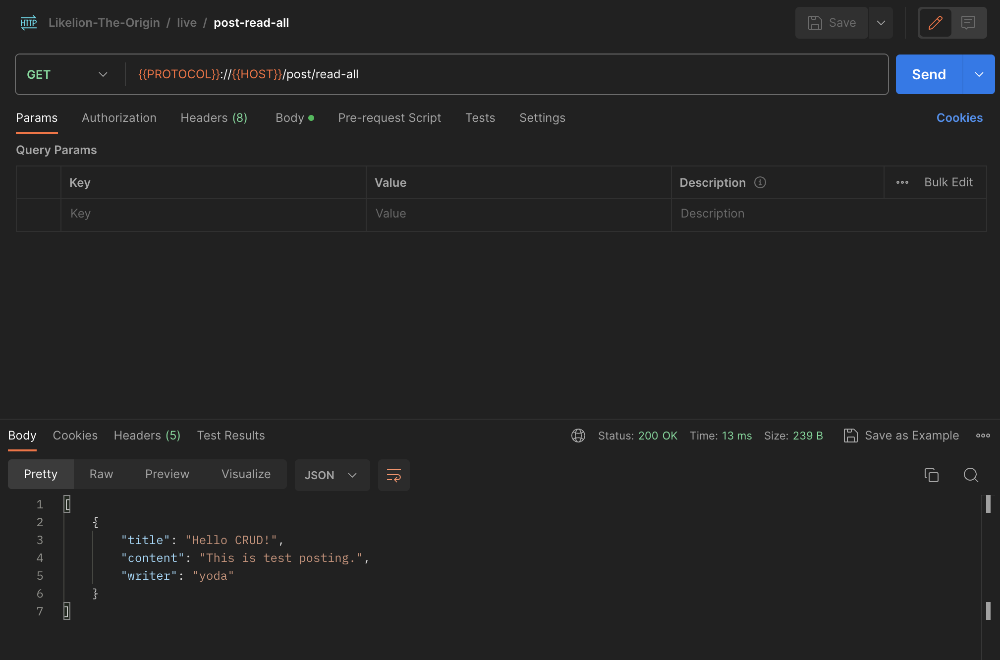

## 4. CRUD & Data (1)

<br>

### 1. CRUD란?

**웹 서비스란?**

- 사용자가 원하는 자원의 관리
- 자원 제공, 제작, 갱신 등
- 부수적인 기능은 서비스 별로 다르게 만들어진다.

<br>

**CRUD**

- 어떤 자원을 사용자에게 제공할 때, 사용할 수 있는 4가지 인터페이스(기능)
- Create - 생성
- Read - 조회
- Update - 갱신
- Delete - 삭제

<br>

- 프로젝트 생성

  

- PostDto

- `post/PostDto`

  ```java
  package dev.yoda.crud.post;
  
  public class PostDto {
      private String title;
      private String content;
      private String writer;
  
      public PostDto() {
      }
  
      public PostDto(String title, String content, String writer) {
          this.title = title;
          this.content = content;
          this.writer = writer;
      }
  
      public String getTitle() {
          return title;
      }
  
      public void setTitle(String title) {
          this.title = title;
      }
  
      public String getContent() {
          return content;
      }
  
      public void setContent(String content) {
          this.content = content;
      }
  
      public String getWriter() {
          return writer;
      }
  
      public void setWriter(String writer) {
          this.writer = writer;
      }
  
      @Override
      public String toString() {
          return "PostDto{" +
                  "title='" + title + '\'' +
                  ", content='" + content + '\'' +
                  ", writer='" + writer + '\'' +
                  '}';
      }
  }

<br>

- **CREATE**

- `post/PostController`

  ```java
  package dev.yoda.crud.post;
  
  import org.slf4j.Logger;
  import org.slf4j.LoggerFactory;
  import org.springframework.stereotype.Controller;
  import org.springframework.web.bind.annotation.PostMapping;
  import org.springframework.web.bind.annotation.RequestBody;
  import org.springframework.web.bind.annotation.RequestMapping;
  import org.springframework.web.bind.annotation.ResponseBody;
  
  import java.util.ArrayList;
  import java.util.List;
  
  @Controller
  @ResponseBody
  @RequestMapping("post")
  public class PostController {
      private static final Logger logger = LoggerFactory.getLogger(PostController.class);
      private final List<PostDto> postList;
  
      public PostController() {
          postList = new ArrayList<>();
      }
  
      @PostMapping("create")
      public void createPost(@RequestBody PostDto postDto) {
          logger.info(postDto.toString());
          this.postList.add(postDto);
      }
  }
  ```

- 포스트맨으로 테스팅하기

  

<br>

- **READ**

- `post/PostController`

  ```java
  package dev.yoda.crud.post;
  
  import org.slf4j.Logger;
  import org.slf4j.LoggerFactory;
  import org.springframework.stereotype.Controller;
  import org.springframework.web.bind.annotation.*;
  
  import java.util.ArrayList;
  import java.util.List;
  
  @Controller
  @ResponseBody
  @RequestMapping("post")
  public class PostController {
      ...
  
      @GetMapping("read-all")
      public List<PostDto> readPostAll() {
          logger.info("in read all");
          return this.postList;
      }
  
      @GetMapping("read-one")
      public PostDto readPostOne(@RequestParam("id") int id) {
          logger.info("in read one");
          return this.postList.get(id);
      }
  }
  
  ```

- 포스트맨으로 테스팅하기 (read-all, read-one)

  

- 

<br>

- **UPDATE**

- `post/PostController`

  ```java
  package dev.yoda.crud.post;
  
  import org.slf4j.Logger;
  import org.slf4j.LoggerFactory;
  import org.springframework.stereotype.Controller;
  import org.springframework.web.bind.annotation.*;
  
  import java.util.ArrayList;
  import java.util.List;
  
  @Controller
  @ResponseBody
  @RequestMapping("post")
  public class PostController {
      ...
  
      @PostMapping("update")
      public void updatePost(
              @RequestParam("id") int id,
              @RequestBody PostDto postDto
      ) {
          PostDto targetPost = this.postList.get(id);
          if(postDto.getTitle() != null) {
              targetPost.setTitle(postDto.getTitle());
          }
          if(postDto.getContent() != null) {
              targetPost.setContent(postDto.getContent());
          }
          this.postList.set(id, targetPost);
      }
  }
  
  ```

- 포스트맨으로 테스팅하기

  

  

<br>

- **DELETE**

- `post/PostController`

  ```java
  package dev.yoda.crud.post;
  
  import org.slf4j.Logger;
  import org.slf4j.LoggerFactory;
  import org.springframework.stereotype.Controller;
  import org.springframework.web.bind.annotation.*;
  
  import java.util.ArrayList;
  import java.util.List;
  
  @Controller
  @ResponseBody
  @RequestMapping("post")
  public class PostController {
      ...
  
      @DeleteMapping("delete")
      public void deletePost(@RequestParam("id") int id) {
          this.postList.remove(id);
      }
  }
  
  ```

- 포스트맨으로 테스팅하기

  

  

<br>

=> 위와 같은 방식들은 좋은 형태는 아니다!

<br>

### 2. CRUD와 REST

**RESTful이란?**

- REpresentational / State / Transfer
- Client와 Server 간의 결합성을 줄이기 위한 가이드
- 즉, Client와 Server 중 어느 한 쪽이 변화하는 것이 상대방에 큰 영향을 끼치지 않도록 한다.
- Client가 사용할 api를 누가 사용해도 큰 문제 없이 사용하게끔 한다.

<br>

**API를 RESTful하게 설계하는 방법**

1. Client Server Architecture
   - 서버와 클라이언트는 서로 잘 분리되어 있어야 한다.
   - 서로의 변화가 서로에게 영향을 주지 않는 형태가 되어야 한다.
2. Statelessness
   - 상태를 가지고 있지 않아야 한다.
   - server 안에 사용자 정보를 기록하지 않는다.
   - 모든 요청은 독립적이어서 요청을 보낸 당사자가 자신이 누구인지 증명할 책임을 가지고 있어야 한다.
   - 원하는 기능을 위한 상태는 client가 가지고 있어야 한다.
3. Cacheability
   - 캐시 가능성을 나타낸다.
   - 수많은 client들은 server에 있던 자원을 본인의 컴퓨터에 저장하는 캐싱 기능을 가지는데, server는 자원의 캐싱이 가능한지의 여부를 항상 표기해줘야 한다.
4. Layered System
   - 계층적인 구조를 가진다.
   - client는 server에 도달하기까지의 과정을 알 필요가 없다.
5. Uniformed Interface
   - 일관된 인터페이스를 가진다.
   - 자원을 나타내기 위해서 사용해야하는 인터페이스를 말한다.
6. Code on Demand (Optional)
   - 사용 가능한 코드를 응답으로 보내, 사용자의 기능을 일시적으로 확장시킬 수 있다.

<br>

**URL & HTTP 요청**

1. 경로(Path)를 통해 도달하고자 하는 자원을 지정
2. 방법(Method)을 통해 자원에 실행할 기능을 지정

<br>

**RestController로 CRUD**

- `post/PostRestController`

- PostController의 RequestMapping 경로를 주석처리하고 작성

  ```java
  package dev.yoda.crud.post;
  
  import org.slf4j.Logger;
  import org.slf4j.LoggerFactory;
  import org.springframework.web.bind.annotation.*;
  
  import java.util.ArrayList;
  import java.util.List;
  
  @RestController
  @RequestMapping("post")
  public class PostRestController {
      private static final Logger logger = LoggerFactory.getLogger(PostRestController.class);
      private final List<PostDto> postList;
  
      public PostRestController() {
          this.postList = new ArrayList<>();
      }
  
      //http://localhost:8080/post
      //POST /post
      //REQUEST_BODY
      @PostMapping
      public void createPost(@RequestBody PostDto postDto) {
          logger.info(postDto.toString());
          this.postList.add(postDto);
      }
  
      //http://localhost:8080/post
      //GET /post
      @GetMapping
      public List<PostDto> readPostAll() {
          logger.info("in read post all");
          return this.postList;
      }
  
      //http://localhost:8080/post?id=0
      //GET /post/0
      @GetMapping("{id}")
      public PostDto readPost(@PathVariable("id") int id) {
          logger.info("in read post");
          return this.postList.get(id);
      }
  
      //@PutMapping: 현재 보내는 데이터를 그 위치에 다시 넣어주세요.
      //@PostMapping: 새로운 것을 만들 때 사용.
      //PUT /post/0
      @PutMapping("{id}")
      public void updatePost(
              @PathVariable("id") int id,
              @RequestBody PostDto postDto
      ) {
          PostDto targetPost = this.postList.get(id);
          if(postDto.getTitle() != null) {
              targetPost.setTitle(postDto.getTitle());
          }
          if(postDto.getContent() != null) {
              targetPost.setContent(postDto.getContent());
          }
          this.postList.set(id, targetPost);
      }
  
      //DELETE /post/0
      @DeleteMapping("{id}")
      public void deletePost(@PathVariable("id") int id) {
          this.postList.remove(id);
      }
  }
  ```

- Postman - create

  

- Postman - read

  

- Postman - read-one

  

- Postman - update

  

- Postman - delete

  
