## 4. CRUD & Data (2)

<br>

### 1. Mybatis 사용해보기

**데이터베이스를 사용하는 이유**

- Spring boot는 Java 클래스를 통해 데이터를 다룬다. (POJO)

  1. Java 코드로 작성한 List, HashMap 등은 memory에 저장된다.

     => spring application이 종료되는 순간, 데이터들도 모두 초기화 된다.

  2. 여러 서버 프로세스가 같은 기능을 하면서 Data를 공유해야 한다.

- => spring boot의 기능을 통해 사용할 Data를 외부의 Database에 저장한다. (persistent data)

<br>

**Mybatis 소개**

- Java 함수를 SQL 선언문과 연결지어 사용
- Java 클래스를 이용하여 SQL 결과를 받거나 SQL 선언문에서 사용할 인자를 전달한다.
- 관계형 데이터베이스의 경우
  - 쿼리문을 전달하면, table(or relation)의 형태의 결과를 돌려받는다.
- Mybatis의 경우
  - sql 선언문들을 XML의 형태로 저장해 놓는다.
  - Application을 실행하면, XML 파일을 불러와 내용물들을 읽어오고, Java Interface와 같이 미리 정의해 놓은 자바 함수들과 연결해 준다.
  - 쿼리문을 전달하면, 결과의 row를 classDto(Data Transfer Object)의 형태로 돌려받는다.

<br>

**Mybatis Demo**

1. project 생성하기

   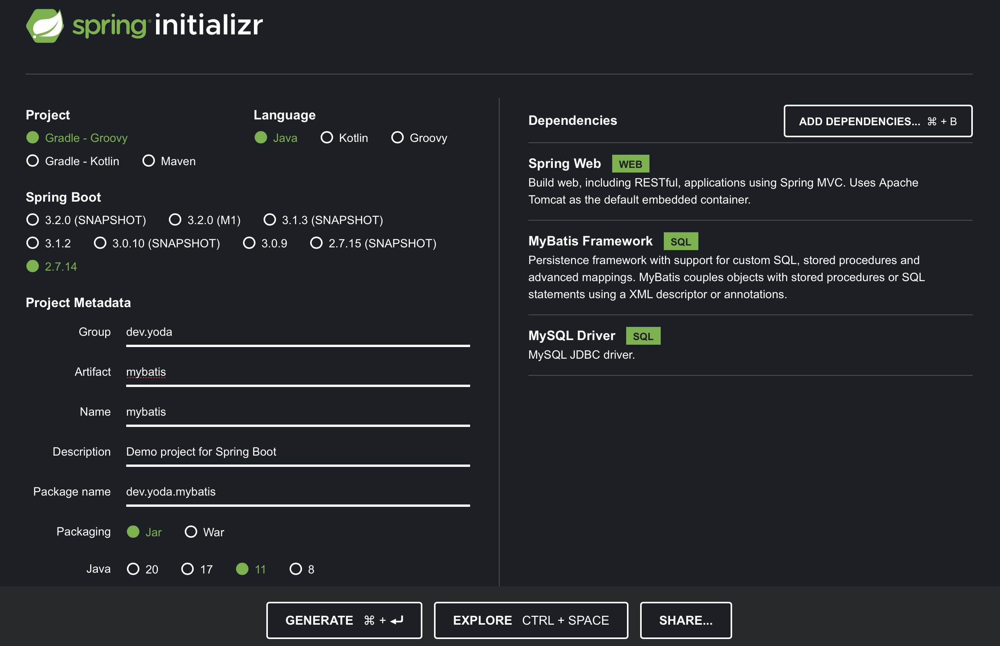

2. `src/main/resources/application.properties`

   ```java
   spring.datasource.driver-class-name=com.mysql.cj.jdbc.Driver
   spring.datasource.url=jdbc:mysql://127.0.0.1:3306/demo_schema
   ```

   - application.properties는 spring boot에서 사용할 설정들을 모아놓는다.
   - spring boot가 해당 설정들을 읽어와 사용하게 된다.

3. `src/main/resources/application.properties` 파일을  `src/main/resources/application.yml`로 대체한다. (application.properties 파일은 삭제한다.)

   ```java
   spring:
     datasource:
       driver-class-name: com.mysql.cj.jdbc.Driver
       url: jdbc:mysql://127.0.0.1:3306/demo_schema
       username: demo_user
       password: hihello01!
   
   mybatis:
   	#  mybatis 폴더의 mappers 폴더의 XML 확장자를 가지는 파일들을 불러오겠다.
     mapper-locations: "classpath:mybatis/mappers/*.xml"
     configuration:
       map-underscore-to-camel-case: true
   ```

   - 보통 구조가 지어져 있다.

4. mapper-locations의 classpath에, xml 파일을 생성한다.

   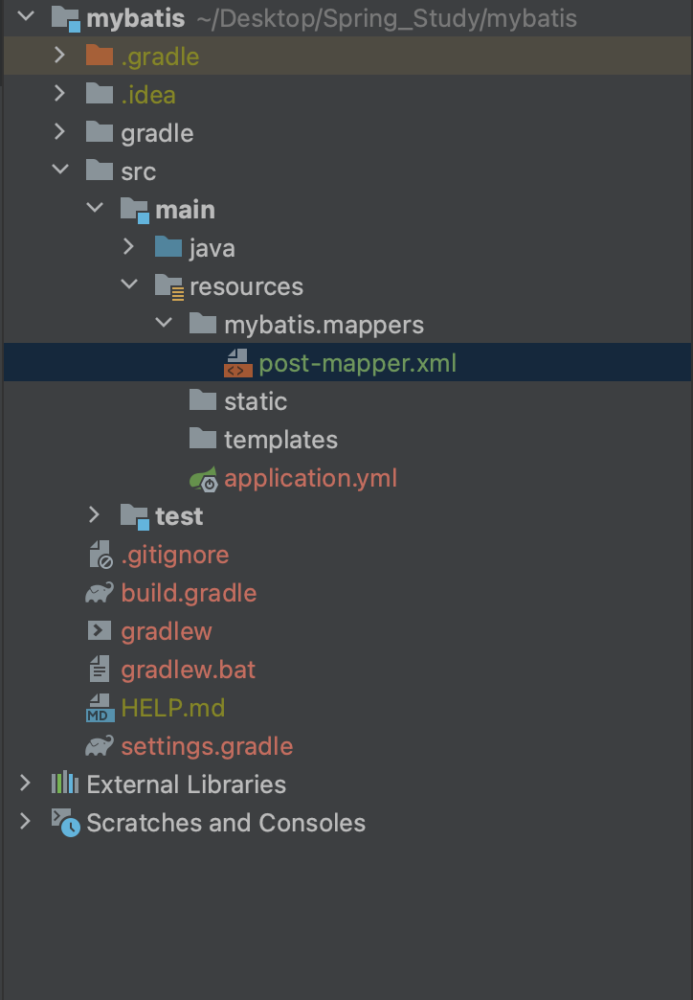

5. `post-mapper.xml` 기본 설정하기

   ```xml
   <?xml version="1.0" encoding="UTF-8" ?>
   <!DOCTYPE mapper PUBLIC "-//mybatis.org//DTD Mapper 3.0//EN"
           "http://mybatis.org/dtd/mybatis-3-mapper.dtd">
   <mapper namespace="dev.yoda.mybatis.mapper.PostMapper">
   
   </mapper>
   ```

6. `board-mapper.xml` 기본 설정하기

   ```xml
   <?xml version="1.0" encoding="UTF-8" ?>
   <!DOCTYPE mapper PUBLIC "-//mybatis.org//DTD Mapper 3.0//EN"
           "http://mybatis.org/dtd/mybatis-3-mapper.dtd">
   <mapper namespace="dev.yoda.mybatis.mapper.BoardMapper">
   
   </mapper>
   ```

<br>

**project structure 둘러보기**

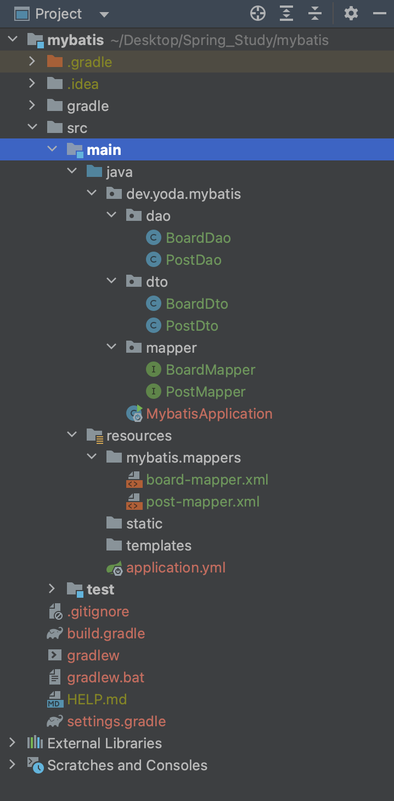

- DAO(Data Access Object)
  - spring boot 기준 repository처럼 데이터를 주고받는 기능을 해주기 위한 class
- DTO(Data Transfer Object)
  - 실제 데이터를 담기 위한 class
- Mapper
  - xml 파일에서 작성한 것들을 Mapper 인터페이스의 함수들과 연결해줌

<br>

**기본 CRUD**

- `post-mapper.xml`

  ```xml
  <?xml version="1.0" encoding="UTF-8" ?>
  <!DOCTYPE mapper PUBLIC "-//mybatis.org//DTD Mapper 3.0//EN"
          "http://mybatis.org/dtd/mybatis-3-mapper.dtd">
  <mapper namespace="dev.yoda.mybatis.mapper.PostMapper">
      <!--mapper의 namespace에 있는 인터페이스와 insert의 id값을 가지고 어떤 함수에 SQL문을 일치시킬지 결정-->
      <insert id="createPost" parameterType="dev.yoda.mybatis.dto.PostDto">
          insert into POST(title, content, writer, board)
          <!--문자열의 경우에는 #, int의 경우에는 $-->
          values (#{title}, #{content}, #{writer}, ${board})
      </insert>
      <select id="readPost" parameterType="int" resultType="dev.yoda.mybatis.dto.PostDto">
          select * from post where id = ${id}
      </select>
      <select id="readPostAll" resultType="dev.yoda.mybatis.dto.PostDto">
          select * from post
      </select>
      <update id="updatePost" parameterType="dev.yoda.mybatis.dto.PostDto">
          update post set (title = #{title}, content = #{content}, writer = #{writer}, board = ${board})
          where id = ${id}
      </update>
      <delete id="deletePost" parameterType="int">
          delete from post where id = ${id}
      </delete>
  </mapper>
  ```

- `PostMapper`

  ```java
  package dev.yoda.mybatis.mapper;
  
  import dev.yoda.mybatis.dto.PostDto;
  
  import java.util.List;
  
  public interface PostMapper {
      int createPost(PostDto dto);
      PostDto readPost(int id);
      List<PostDto> readPostAll();
      int updatePost(PostDto dto);
      int deletePost(int id);
  
  }
  ```

- `PostDto`

  ```java
  package dev.yoda.mybatis.dto;
  
  /*
  id int
  title varchar
  content varchar
  writer varchar
  board int
  */
  public class PostDto {
      private int id;
      private String title;
      private String content;
      private String writer;
      private int board;
  
      public PostDto() {
      }
  
      public PostDto(int id, String title, String content, String writer, int board) {
          this.id = id;
          this.title = title;
          this.content = content;
          this.writer = writer;
          this.board = board;
      }
  
      public int getId() {
          return id;
      }
  
      public void setId(int id) {
          this.id = id;
      }
  
      public String getTitle() {
          return title;
      }
  
      public void setTitle(String title) {
          this.title = title;
      }
  
      public String getContent() {
          return content;
      }
  
      public void setContent(String content) {
          this.content = content;
      }
  
      public String getWriter() {
          return writer;
      }
  
      public void setWriter(String writer) {
          this.writer = writer;
      }
  
      public int getBoard() {
          return board;
      }
  
      public void setBoard(int board) {
          this.board = board;
      }
  
      @Override
      public String toString() {
          return "PostDto{" +
                  "id=" + id +
                  ", title='" + title + '\'' +
                  ", content='" + content + '\'' +
                  ", writer='" + writer + '\'' +
                  ", board=" + board +
                  '}';
      }
  }
  ```

- `PostDao`

  ```java
  package dev.yoda.mybatis.dao;
  
  import dev.yoda.mybatis.dto.PostDto;
  import dev.yoda.mybatis.mapper.PostMapper;
  import org.apache.ibatis.session.SqlSession;
  import org.apache.ibatis.session.SqlSessionFactory;
  import org.springframework.beans.factory.annotation.Autowired;
  import org.springframework.stereotype.Repository;
  
  import java.util.List;
  
  @Repository
  public class PostDao {
      private final SqlSessionFactory sessionFactory;
  
      public PostDao(
              @Autowired SqlSessionFactory sessionFactory
      ) {
          this.sessionFactory = sessionFactory;
      }
  
      public int createPost(PostDto dto) {
          //session은 sessionFactory를 받고 열어주면 됨
          try(SqlSession session = sessionFactory.openSession()) {
              //PostMapper 인터페이스를 구현한 구현체가 mapper에 주입 됨
              PostMapper mapper = session.getMapper(PostMapper.class);
              return mapper.createPost(dto);
          }
      }
  
      public PostDto readPost(int id) {
          try(SqlSession session = sessionFactory.openSession()) {
              PostMapper mapper = session.getMapper(PostMapper.class);
              return mapper.readPost(id);
          }
      }
  
      public List<PostDto> readPostAll() {
          try(SqlSession session = sessionFactory.openSession()) {
              PostMapper mapper = session.getMapper(PostMapper.class);
              return mapper.readPostAll();
          }
      }
  
      public int updatePost(PostDto dto) {
          try(SqlSession session = sessionFactory.openSession()) {
              PostMapper mapper = session.getMapper(PostMapper.class);
              return mapper.updatePost(dto);
          }
      }
  
      public int deletePost(int id) {
          try(SqlSession session = sessionFactory.openSession()) {
              PostMapper mapper = session.getMapper(PostMapper.class);
              return mapper.deletePost(id);
          }
      }
  }
  ```

<br>

### 2. ORM

**관계형 데이터베이스의 한계**

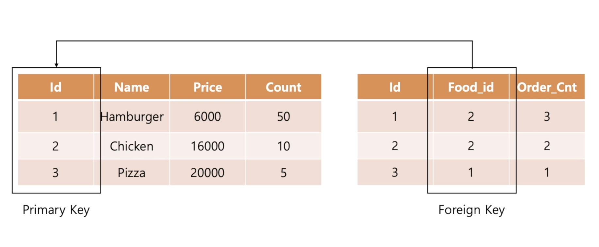

- 관계형 데이터베이스는 서로 연관성이 있는 테이블의 데이터를 표현하기 위해 Primary Key와 Foreign Key를 사용한다.

- `FoodDto`

  ```java
  public class FoodDto{
    private int id;
    private String name;
    private int price;
    private int count;
  }
  ```

- `OrderDto`

  ```java
  public class OrderDto{
    private int id;
    private int foodId;
    private int orderCount;
  }
  ```

- OderDto의 foodId가 문제이다.

- class 입장에서는 아무 쓸모가 없는 데이터이다.

- 객체 지향의 관점에서 id로 객체를 검색하는 형태가 비효율적이다.

- 관계형 데이터베이스에서 사용하는 자료의 형태가 객체 지향 관점에서 맞지 않아서 생기는 간극 때문이다.

<br>

**Object Relational Mapping**

- 관계형 데이터를 객체로 표현하는 프로그래밍 기법

- `Food`

  ```java
  public class Food{
    private String name;
    private int price;
    private int count;
  }
  ```

- `Order`

  ```java
  public class Order{
    private Food orderFood;
    private int orderCount;
  }
  ```

<br>

**JPA Hibernate (Java Persistent API)**

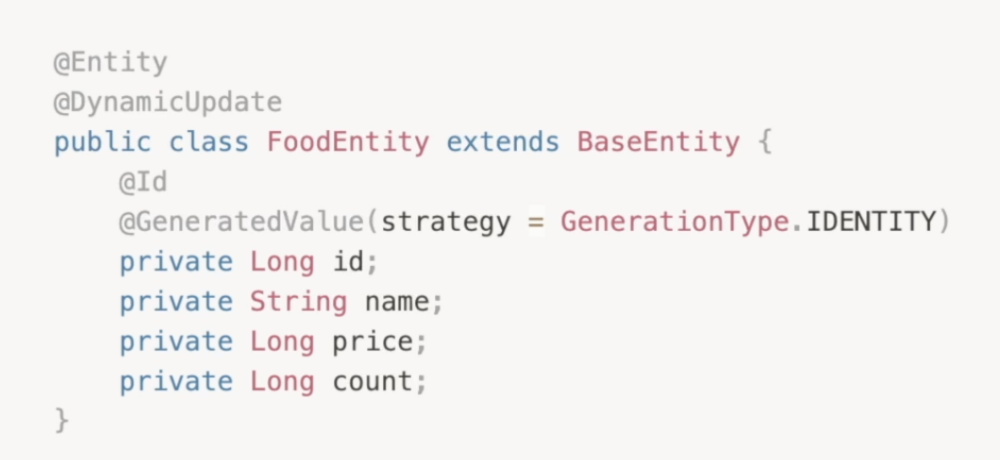

- JPA는 이미 존재하는 자바의 객체들이 데이터 상에서 어떻게 정의되는 지 나타내는 일련의 annotation들
- JPA 자체는 관계형 데이터를 객체로 표기하는 기능 뿐
- Hibernate 프레임워크는 JPA를 이용해서 ORM을 구현한 기술이다.

<br>

### 3. JPA 활용하기

**기본 세팅**

1. project 생성

   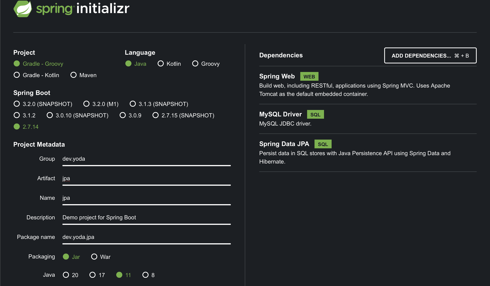

2. schema 생성 (schemas - create schema) 

   - localhost-root에서 작업

   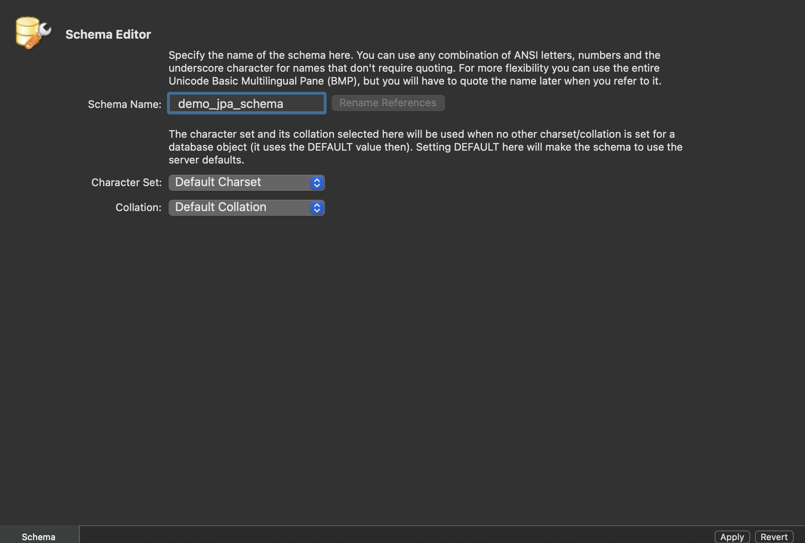

3. user 생성 (Users and Privileges - Add Account)

   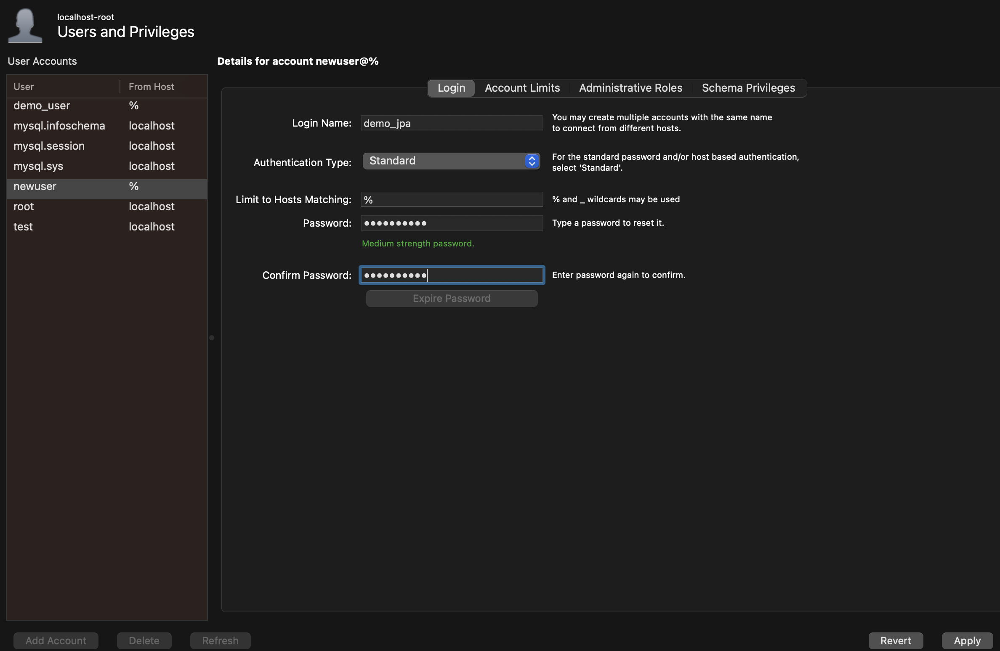

   - Schema Privileges - Add Entry - demo_jpa_schema - Select "All" - Apply

4. connection 생성 ('terminal' mysql -u demo_jpa -p)

   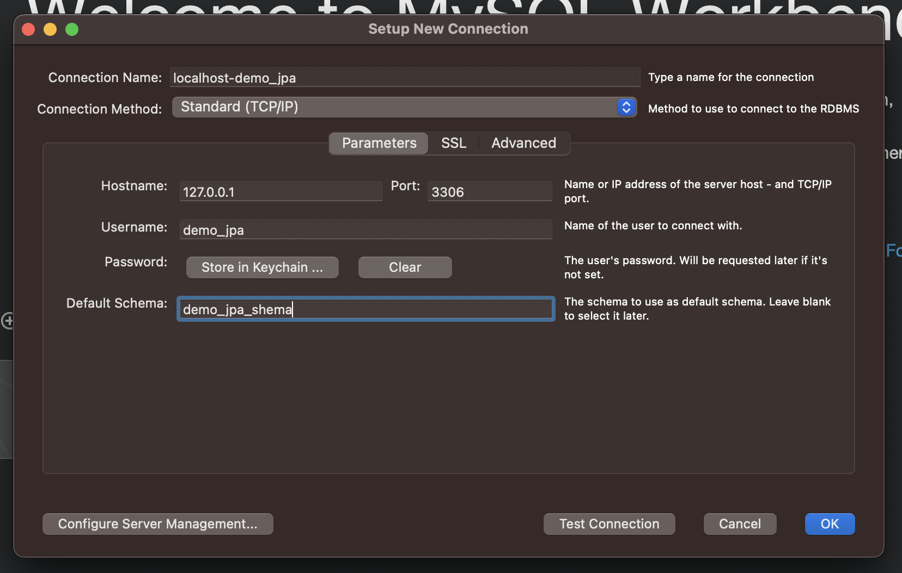

5. project의 `application.properties`를 `application.yml`로 바꾸기

   ```yml
   spring:
     datasource:
       driver-class-name: com.mysql.cj.jdbc.Driver
       url: jdbc:mysql://127.0.0.1:3306/demo_jpa_schema
       username: demo_jpa
       password: hihello01!
     jpa:
       hibernate:
         ddl-auto: create
       show-sql: false
       properties:
         hibernate:
           dialect: org.hibernate.dialect.MySQL8Dialect
   ```

<br>

**structure 살펴보기**

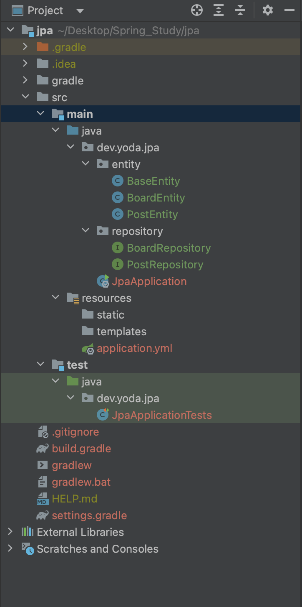

<br>

**entity 생성**

- `PostEntity`

  ```java
  package dev.yoda.jpa.entity;
  
  import javax.persistence.*;
  
  /*
  id int
  title varchar
  content varchar
  writer varchar
  board int
  */
  @Entity
  public class PostEntity {
      @Id
      @GeneratedValue(strategy = GenerationType.IDENTITY)
      private Long id;
  
      private String title;
      private String content;
      private String writer;
  
      @ManyToOne(
              targetEntity = BoardEntity.class,
              fetch = FetchType.LAZY
      )
      private BoardEntity boardEntity;
  
      public PostEntity() {
      }
  
      public PostEntity(Long id, String title, String content, String writer, BoardEntity boardEntity) {
          this.id = id;
          this.title = title;
          this.content = content;
          this.writer = writer;
          this.boardEntity = boardEntity;
      }
  
      public Long getId() {
          return id;
      }
  
      public void setId(Long id) {
          this.id = id;
      }
  
      public String getTitle() {
          return title;
      }
  
      public void setTitle(String title) {
          this.title = title;
      }
  
      public String getContent() {
          return content;
      }
  
      public void setContent(String content) {
          this.content = content;
      }
  
      public String getWriter() {
          return writer;
      }
  
      public void setWriter(String writer) {
          this.writer = writer;
      }
  
      public BoardEntity getBoardEntity() {
          return boardEntity;
      }
  
      public void setBoardEntity(BoardEntity boardEntity) {
          this.boardEntity = boardEntity;
      }
  }
  ```

- `BoardEntity`

  ```java
  package dev.yoda.jpa.entity;
  
  /*
  id int
  name varchar
  */
  
  import javax.persistence.*;
  import java.util.ArrayList;
  import java.util.List;
  
  @Entity
  public class BoardEntity {
      @Id
      @GeneratedValue(strategy = GenerationType.IDENTITY)
      private Long id;
  
      private String name;
  
      @OneToMany(
              targetEntity = PostEntity.class,
              fetch = FetchType.LAZY,
              //PostEntity의 ManyToOne에 정의된 변수명 boardEntity와 동일
              mappedBy = "boardEntity"
      )
      private List<PostEntity> postEntityList = new ArrayList<>();
  
      public BoardEntity() {
      }
  
      public BoardEntity(Long id, String name, List<PostEntity> postEntityList) {
          this.id = id;
          this.name = name;
          this.postEntityList = postEntityList;
      }
  
      public Long getId() {
          return id;
      }
  
      public void setId(Long id) {
          this.id = id;
      }
  
      public String getName() {
          return name;
      }
  
      public void setName(String name) {
          this.name = name;
      }
  
      public List<PostEntity> getPostEntityList() {
          return postEntityList;
      }
  
      public void setPostEntityList(List<PostEntity> postEntityList) {
          this.postEntityList = postEntityList;
      }
  }
  ```

- annotation을 달고 실행시키면 table이 생성된다.

  

<br>

**repository 생성 및 테스팅**

- `BoardRepository`

  ```java
  package dev.yoda.jpa.repository;
  
  import dev.yoda.jpa.entity.BoardEntity;
  import org.springframework.data.repository.CrudRepository;
  
  public interface BoardRepository extends CrudRepository<BoardEntity, Long> {
  }
  ```

- `PostRepository`

  ```java
  package dev.yoda.jpa.repository;
  
  import dev.yoda.jpa.entity.PostEntity;
  import org.springframework.data.repository.CrudRepository;
  
  public interface PostRepository extends CrudRepository<PostEntity, Long> {
  }
  ```

- `dev.yoda.jpa/TestComponent`

  ```java
  package dev.yoda.jpa;
  
  import dev.yoda.jpa.entity.BoardEntity;
  import dev.yoda.jpa.entity.PostEntity;
  import dev.yoda.jpa.repository.BoardRepository;
  import dev.yoda.jpa.repository.PostRepository;
  import org.springframework.beans.factory.annotation.Autowired;
  import org.springframework.stereotype.Component;
  
  @Component
  public class TestComponent {
      public TestComponent(
              @Autowired BoardRepository boardRepository,
              @Autowired PostRepository postRepository
              ) {
          BoardEntity boardEntity = new BoardEntity();
          boardEntity.setName("new board");
          //save 이후의 내용들을 보기 위해 결과물로 돌려주는 entity가 필요
          BoardEntity newBoardEntity = boardRepository.save(boardEntity);
  
          PostEntity postEntity = new PostEntity();
          postEntity.setTitle("hello ORM");
          postEntity.setContent("This Entity is created by hibernate!");
          postEntity.setWriter("yoda");
          postEntity.setBoardEntity(newBoardEntity);
          PostEntity newPostEntity = postRepository.save(postEntity);
      }
  }
  ```

<br>

**repository 커스터마이징**

- `PostRepository`

  ```java
  package dev.yoda.jpa.repository;
  
  import dev.yoda.jpa.entity.BoardEntity;
  import dev.yoda.jpa.entity.PostEntity;
  import org.springframework.data.repository.CrudRepository;
  
  import java.util.List;
  
  public interface PostRepository extends CrudRepository<PostEntity, Long> {
      List<PostEntity> findAllByWriter(String writer); // where writer = ?
      List<PostEntity> findAllByWriterAndBoardEntity(String writer, BoardEntity boardEntity); // where writer =? and board_entity_id = ?
      List<PostEntity> findAllByWriterContaining(String writer);
  }
  ```

- `dev.yoda.jpa/TestComponent`

  ```java
  @Component
  public class TestComponent {
      public TestComponent(
              @Autowired BoardRepository boardRepository,
              @Autowired PostRepository postRepository
              ) {
          ...
  
          //db에 현재 writer=yoda인 데이터가 하나이므로, log에 1이 찍힘.
          System.out.println(postRepository.findAllByWriter("yoda").size());
      }
  }
  ```

<br>

**base entity**

- `BaseEntity`

  ```java
  package dev.yoda.jpa.entity;
  
  import org.springframework.data.annotation.CreatedDate;
  import org.springframework.data.annotation.LastModifiedDate;
  import org.springframework.data.jpa.domain.support.AuditingEntityListener;
  
  import javax.persistence.Column;
  import javax.persistence.EntityListeners;
  import javax.persistence.MappedSuperclass;
  import java.time.Instant;
  
  @MappedSuperclass //모든 entity들이 가져야 할 속성 정의
  @EntityListeners(AuditingEntityListener.class)
  //추상 클래스
  public abstract class BaseEntity {
      //처음 생성 시간
      @CreatedDate
      @Column(updatable = false)
      private Instant createdAt;
  
      //마지막 갱신 시간
      @LastModifiedDate
      @Column(updatable = true)
      private Instant updatedAt;
  
      public Instant getCreatedAt() {
          return createdAt;
      }
  
      public void setCreatedAt(Instant createdAt) {
          this.createdAt = createdAt;
      }
  
      public Instant getUpdatedAt() {
          return updatedAt;
      }
  
      public void setUpdatedAt(Instant updatedAt) {
          this.updatedAt = updatedAt;
      }
  }
  ```

- 다른 entity들에 추상 클래스 extends

- `PostEntity`

  ```java
  @Entity
  public class PostEntity extends BaseEntity {
      
  }
  ```

- `BoardEntity`

  ```java
  @Entity
  public class BoardEntity extends BaseEntity {
     
  }
  ```

- Auditing 허용

- `JpaApplication`

  ```java
  @SpringBootApplication
  //Auditing은 JPA의 기본 속성이 아니므로 허용해 줘야 함.
  @EnableJpaAuditing
  public class JpaApplication {
  
  	public static void main(String[] args) {
  		SpringApplication.run(JpaApplication.class, args);
  	}
  
  }
  ```

<br>

**db에 원하는 이름 적용**

- `PostEntity`

  ```java
  @Entity
  @Table(name = "post") //table 명 설정
  public class PostEntity extends BaseEntity {
      ...
  
      @ManyToOne(
              targetEntity = BoardEntity.class,
              fetch = FetchType.LAZY
      )
      @JoinColumn(name = "board_id") //boardEntity 참조 column 명을 board_id로 설정
      private BoardEntity boardEntity; 
  }
  ```

- `BoardEntity`

  ```java
  @Entity
  @Table(name = "board") //table 명 설정
  public class BoardEntity extends BaseEntity {
    ...
      
      @Column(name = "board_name") //column 명 설정
      private String name;
  
  }
  ```

<br>

### 4. CRUD에 데이터베이스 적용

**controller, service, repository**

- 기본 세팅

  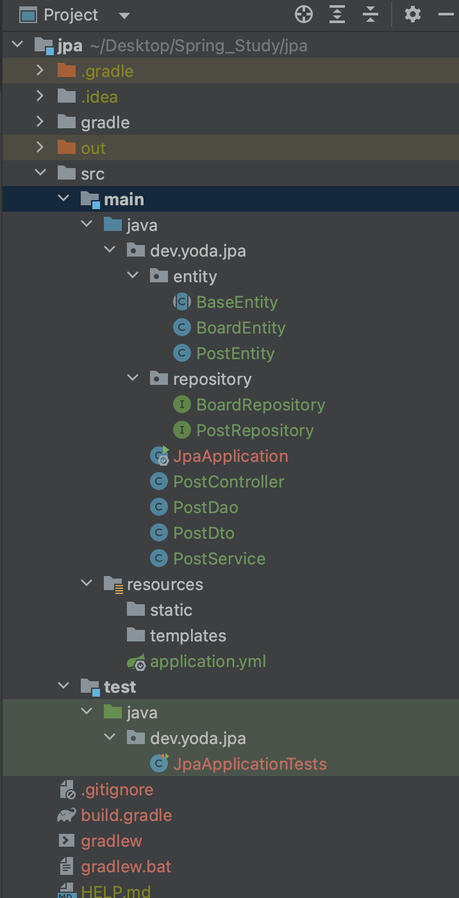

  - `PostDto`

    ```java
    package dev.yoda.jpa;
    
    public class PostDto {
        private int id;
        private String title;
        private String content;
        private String writer;
        private int boardId;
    
        public PostDto() {
        }
    
        public PostDto(int id, String title, String content, String writer, int boardId) {
            this.id = id;
            this.title = title;
            this.content = content;
            this.writer = writer;
            this.boardId = boardId;
        }
    
        public int getId() {
            return id;
        }
    
        public void setId(int id) {
            this.id = id;
        }
    
        public String getTitle() {
            return title;
        }
    
        public void setTitle(String title) {
            this.title = title;
        }
    
        public String getContent() {
            return content;
        }
    
        public void setContent(String content) {
            this.content = content;
        }
    
        public String getWriter() {
            return writer;
        }
    
        public void setWriter(String writer) {
            this.writer = writer;
        }
    
        public int getBoardId() {
            return boardId;
        }
    
        public void setBoardId(int boardId) {
            this.boardId = boardId;
        }
    
        @Override
        public String toString() {
            return "PostDto{" +
                    "id=" + id +
                    ", title='" + title + '\'' +
                    ", content='" + content + '\'' +
                    ", writer='" + writer + '\'' +
                    ", boardId=" + boardId +
                    '}';
        }
    }
    
    ```

  - `PostDao`

    ```java
    package dev.yoda.jpa;
    
    import dev.yoda.jpa.repository.PostRepository;
    import org.slf4j.Logger;
    import org.slf4j.LoggerFactory;
    import org.springframework.beans.factory.annotation.Autowired;
    import org.springframework.stereotype.Repository;
    
    @Repository
    public class PostDao {
        private static final Logger logger = LoggerFactory.getLogger(PostDao.class);
        private final PostRepository postRepository;
    
        public PostDao(
                @Autowired PostRepository postRepository
        ) {
            this.postRepository = postRepository;
        }
    
        public void createPost(PostDto dto) {
            
        }
    
        public void readPost(int id) {
    
        }
    
        public void readPostAll() {
    
        }
    
        public void updatePost(int id, PostDto dto) {
    
        }
    
        public void deletePost(int id) {
    
        }
    }
    ```

  - `PostService`

    ```java
    package dev.yoda.jpa;
    
    import org.slf4j.Logger;
    import org.slf4j.LoggerFactory;
    import org.springframework.stereotype.Service;
    
    import java.util.List;
    
    @Service
    public class PostService {
        private static final Logger logger = LoggerFactory.getLogger(PostService.class);
      	private final PostDao postDao;
    
        public PostService(
                @Autowired PostDao postDao
        ) {
            this.postDao = postDao;
        }
    
        public void createPost(PostDto postDto) {
    
        }
    
        public PostDto readPost(int id) {
    
        }
    
        public List<PostDto> readPostAll() {
    
        }
    
        public void updatePost(int id, PostDto postDto) {
    
        }
    
        public void deletePost(int id) {
    
        }
    
    }
    ```

  - `PostController`

    ```java
    package dev.yoda.jpa;
    
    import org.slf4j.Logger;
    import org.slf4j.LoggerFactory;
    import org.springframework.beans.factory.annotation.Autowired;
    import org.springframework.http.HttpStatus;
    import org.springframework.web.bind.annotation.*;
    
    import java.util.List;
    
    @RestController
    @RequestMapping("post")
    public class PostController {
        private static final Logger logger = LoggerFactory.getLogger(PostController.class);
        private final PostService postService;
    
        public PostController(
                @Autowired PostService postService
        ) {
            this.postService = postService;
        }
    
        @PostMapping()
        @ResponseStatus(HttpStatus.CREATED)
        public void createPost(@RequestBody PostDto dto) {
    
        }
    
        @GetMapping("{id}")
        public PostDto readPost(@PathVariable("id") int id) {
    
        }
    
        @GetMapping("")
        public List<PostDto> readPostAll() {
    
        }
    
        @PutMapping("{id}")
        @ResponseStatus(HttpStatus.ACCEPTED)
        public void updatePost(
                @PathVariable("id") int id,
                @RequestBody PostDto dto) {
    
        }
    
        @DeleteMapping("{id}")
        @ResponseStatus(HttpStatus.ACCEPTED)
        public void deletePost(@PathVariable("id") int id) {
    
        }
    }
    ```

  - 나머지 부분들 채워주기

<br>

**포스트맨으로 테스팅하기**

- 테스팅 해서 잘 동작하면 성공!
- 이때, 데이터베이스는 데이터의 index가 0이 아니라 1부터 시작한다.
- 그리고, 데이터베이스를 영구적으로 두고 싶으면, ddl-auto를 none으로 둬라.

