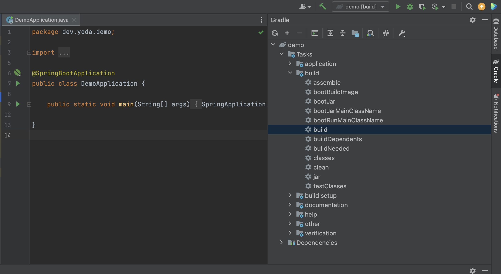
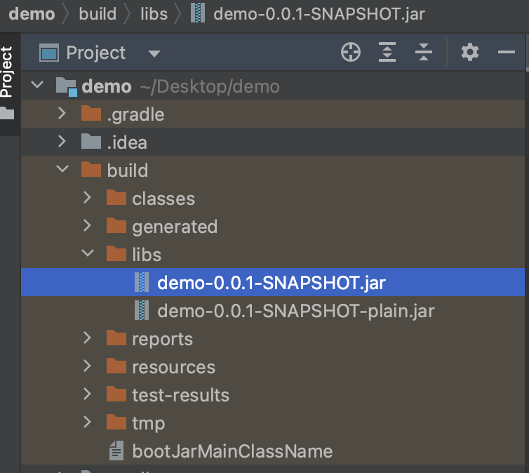
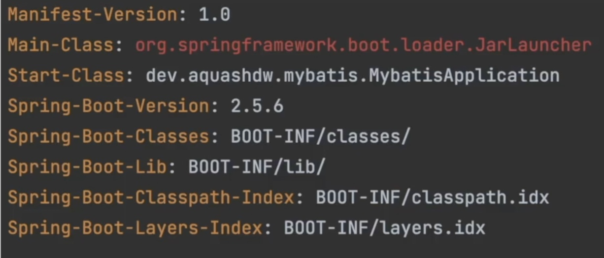
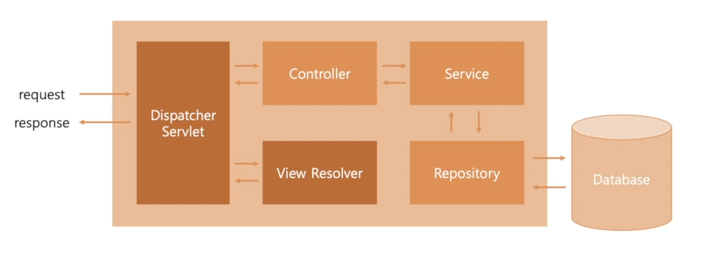
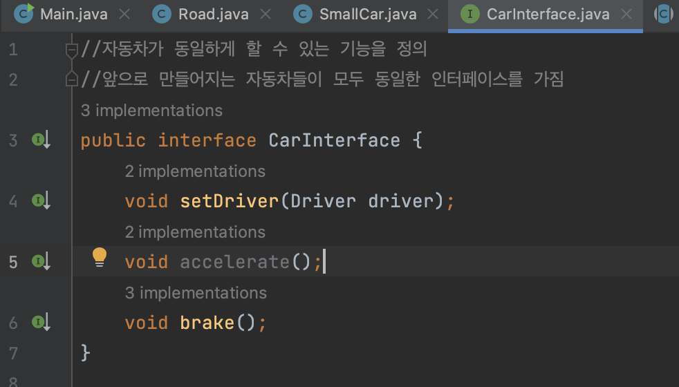
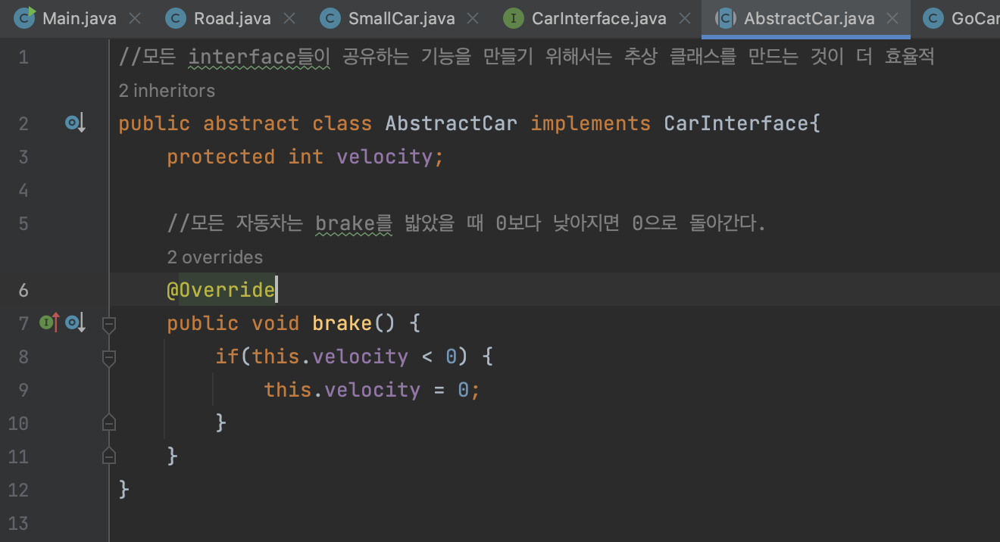
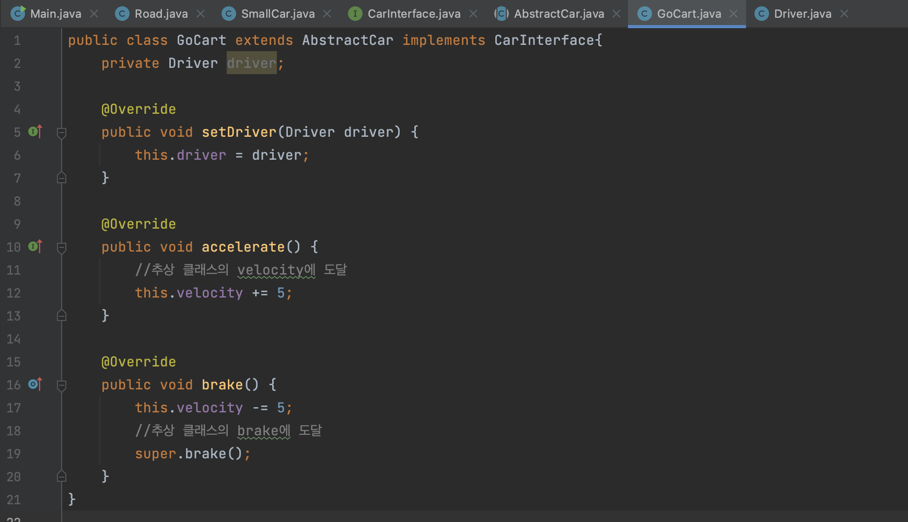
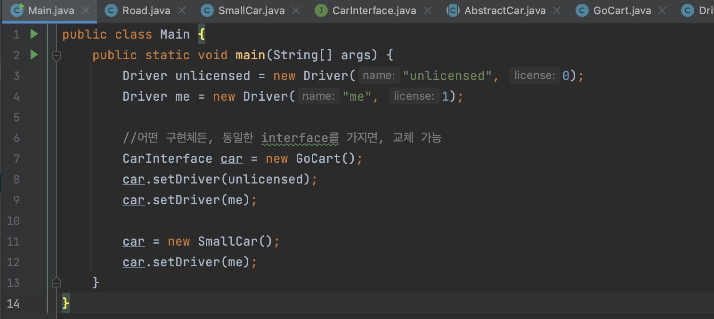
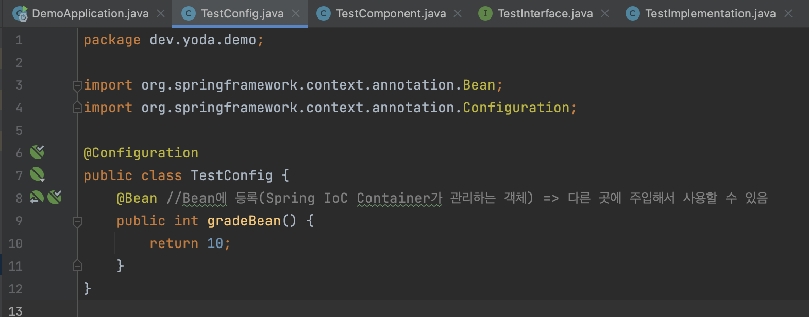
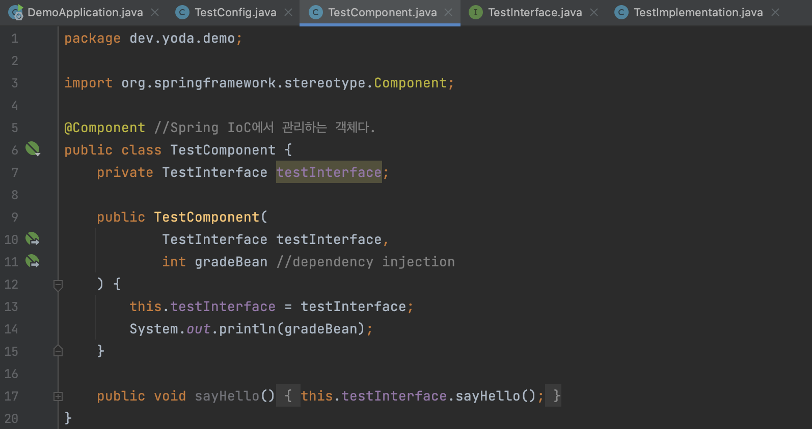

## 2. Spring Boot Basics (1)

**Java와 Build Automation Tool**

- Compile: 소스코드를 기계어로 바꾸는 과정
- => Java Bytecode로 변환 -> Java Bytecode 실행 -> 실행 가능한 파일로 제작 (패키징)
- 이 모든 과정을 javac로 하기에는 과정이 너무 복잡하다!
- => Maven과 Gradle이 필요! (자바 프로젝트를 자동화 시켜주는 도구)

 

**Maven**

- Java를 위한 Build Automation Tool
- Project Object Model(POM)
- xml의 형태로 프로젝트를 정의
- pom.xml을 분석해 프로젝트 빌드

 

**Gradle**

- Java를 위한 Build Automation Tool
- build.gradle
- groovy라는 언어로 프로젝트 정의
- Sub-project 등을 포함시키는 용도의 settings.gradle도 있다.
- Kotlin을 사용하여 정의할 수도 있다.

 

**gradle에서 빌드하는 방법**

1) 아래 사진에서 보이는 build를 실행한다.

2. 아래 사진처럼 build폴더가 생기고 libs 폴더의 jar 파일이 우리가 원하는 결과물이다.

 

**일반적인 웹 서비스의 배포 구조**

- 들어온 신호(IP주소: 189.206.151.236:80) ->  물리적 컴퓨터/서버(189.206.151.236) -> Web Server(80) -> Filesystem(서버를 설정함으로써, 어떤 요청이 들어오면 어떤 폴더의 파일을 돌려줘라!) -> Web Application Server(톰캣) -> Java Web Application(WAR 파일) / spring boot
- => (hardware -> web server -> filesystem / spring boot) 등 서버 구성 방법은 다양함

 

**Java와 Jar**

- Spring boot 프로젝트를 빌드하면 jar 파일이 나온다.

- JAR = Java ARchive

- : Java로 작성 후 컴파일된 Java Bytecode와, 실행을 위해 필요한 다양한 자원을, 배포를 위하여 모아놓은 파일의 형태

- MANIFEST.MF

  

  - Main-Class: Program의 Entry Point, 시작점 = Main 함수

- Jar 파일은 'java -jar' 명령으로 실행할 수 있다.

 

**Web Application의 구조**

- Presentation Layer: 사용자와 직접적으로 맞닿는 부분

- Logic Layer: 요청을 처리하는 결정을 내리는 부분

- Data Layer: 데이터를 저장하고 불러오는 부분

  

  - Dispatcher Servlet: Http 서버 역할을 하는 것들을 거쳐서 요청을 받아냄
  - Controller: Dispatcher Servelet의 요청을 직접적으로 받음
  - Service: Controller를 통해 검증이 된 요청을 받아서 사용자의 입력에 따른 데이터의 조작을 결정함
  - Repository: 데이터의 표현을 받아서 실제로 데이터를 저장하고 돌려줌

 

**Java의 Interface와 Abstract Class**

=> Interface를 잘 활용하면 서로 다른 구현체가 같은 목적을 위해 동작하도록 만들 수 있다.

=> 사용하고자 하는 객체의 실제 자료형과 무관하게 동작하게 만들 수 있다.

=> 모든 interface들이 공유하는 기능을 만들기 위해서는 추상 클래스를 만드는 것이 효율적이다.

=> 하나의 클래스는 추상클래스를 extends하고 인터페이스를 implements 할 수 있다.

=> override를 통해 인터페이스의 메서드들을 정의할 수 있다.

=> super을 통해 추상클래스의 메서드에 도달할 수 있다.

=> interface를 통해 서로 다른 구현체를 연결 할 수 있다.

 

**Spring IoC Container와 DI**

Ioc

- Inversion of Control(제어 역전)
- 프레임워크가 자신이 해야 하는 역할을 정확히 가지고 있다면, 개발자의 코드를 프레임워크가 가져다 쓴다.
- => 개발자의 코드가 프레임워크가 사용하도록 제어가 역전되었다.

 

Spring IoC Container

- 스프링에서 IoC를 담당하는 부분
- 프레임워크를 기반으로 만든 어플리케이션이 작동을 할 때, 개발자가 작성한 코드와 설정 정보를 합쳐서 만들어져야하는 객체들을 직접 만들어줌
- 스프링에서는 개발자가 작성한 코드와 설정 정보를 합친 것을 Beans 라고 부름 
- => Beans = Spring IoC Container가 관리하는 객체

 

DI(Dependency Injection)

- 의존성 주입

- 이미 존재하는 Bean을, 필요한 시점에 다시 주입을 시켜서 사용을 할 수 있도록 해주는 부분

- 사용자가 정의한 구현체 Bean을 실제 서비스에서 사용

  

  => Bean에 등록하여 Spring IoC Container가 관리하는 객체로 만들어줌

  

  => Dependency Injection이 일어남

 

**Spring과 Spring Boot의 차이**

- 개발자의 코드와 설정을 합쳐서 Bean이라는 객체를 만듬
- Spring 프레임워크는 XML의 형태로 설정을 만들었다. 반면, Spring Boot는 Spring Boot Starter에 설정이 정의가 되어있다.
- 또, Spring 프레임워크는 실행을 위해 Tomcat과 같은 프로그램이 필요하다. 반면, Spring Boot는 Tomcat과 같은 서버 프로그램이 내장되어, Jar의 형태로 실행이 가능하다.