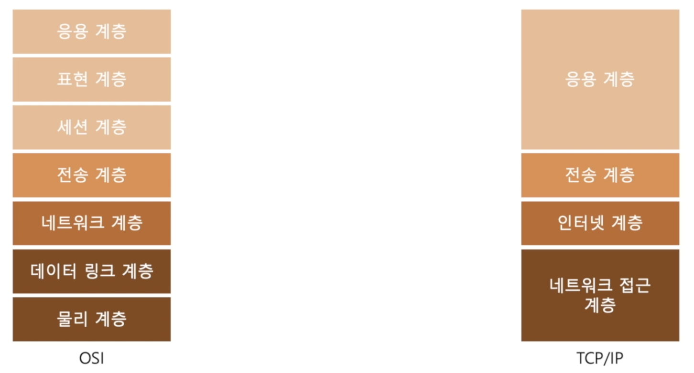

## 3. Spring Boot Basics (2)

<br>

### 1. 컴퓨터 통신과 HTTP

**HTTP란?**



- 가장 하단부: 집에서 일어나는 일들. 컴퓨터의 LAN, 모뎀 등
- 한 계층 위: 컴퓨터와 연결된 인터넷이 어떻게 이루어져 있는지.
- 전송 계층: 인터넷 상에서 데이터를 어떻게 주고받는지.
- 가장 상단부: 컴퓨터들이 연결된 상태, 통신을 할 때 데이터 형식을 완화 등.
- *응용 계층: HTTP, SMTP, FTP - 주고받을 데이터를 어떤 규칙을 가지고 작성하느냐
- => 응용 계층을 사용하는 데에 spring boot가 도움을 준다.

<br>

**그래서 HTTP란?**

- HyperText(정보를 담고 있는 문자) Transfer(통신) Protocol(규약)
- 응용 계층에 정의된 통신 규약
- 서버와 클라이언트 간에 메시지를 전달하는 형식을 정의한 규약

<br>

**HTTP 요청 / 응답의 형식**


- HTTP 요청
- Request Line: Method, Path, Version
- Request Headers: HTTP 요청에 대한 부수적인 데이터
- Request Body: HTTP 요청에 관한 실제 데이터


- HTTP 응답
- Status Line: 요청 처리에 대한 상태 표시줄
- Response Headers: HTTP 응답에 대한 부수적인 데이터
- Response Body: 응답 데이터


- URL(Uniform Resource Locator)
- Internet 상에 자원의 위치를 나타내는 문자열
- [인터넷 상의 컴퓨터를 나타내는 부분]
- `Scheme`: 어떤 규약을 사용하는지. 어떠한 형태로 요청을 보내야하는지
- `userinfo`: 통신 규약에 따라 필요할 수도, 필요하지 않을 수도
- `host`: 어떤 곳으로 보낼 지
- `port`: 어떤 포트로 보낼 지
- [컴퓨터 안의 위치(경로)]
- `path`: 어떤 폴더에 어떤 파일이 있는지
- `query`: 조회를 할 때 필요한 부수적인 정보를 제공
- `fragment`: 하나의 문서의 어떤 부분을 나타냄

<br>

**Media Types**

- JSON과 Multipart Form-Data를 많이 활용한다.
- 일반적인 데이터를 표현한 객체(VO)는 JSON 형태로 주고받는다.

<br>

### 2. Controller와 RestController

**Spring MVC**


- View: 사용자가 확인하는 데이터의 표현
- Controller: 사용자의 입출력을 다루는 부분
- Model: 서비스 데이터 자체


- spring mvc 자체의 구조
- 이 중에서 주로 다룰 부분은 controller와 model 부분

<br>

**controller-demo**

- spring initializr

  

<br>

- hello url에 접속하면 화면에 HELLO WORKS! 출력하기

- `SampleController`

  ```java
  package dev.yoda.controllerdemo;
  
  import org.slf4j.Logger;
  import org.slf4j.LoggerFactory;
  import org.springframework.stereotype.Controller;
  import org.springframework.web.bind.annotation.*;
  
  @Controller
  public class SampleController {
      //로그 관리
      private static final Logger logger
              = LoggerFactory.getLogger(SampleController.class);
  
      //어떠한 경로에 어떤 함수를 호출
      @RequestMapping(
              value = "/hello", //url
              method = RequestMethod.GET //get 방식
      )
      //hello 라는 함수를 호출하겠다.
      public String hello() {
        return "/hello.html";
      }
  }  
  ```

- vscode로 controller-demo 폴더를 열어서 작업

- Static 폴더에 hello.html 생성

- `hello.html`

  ```html
  <!DOCTYPE html>
  <html lang="en">
  <head>
      <meta charset="UTF-8">
      <meta name="viewport" content="width=device-width, initial-scale=1.0">
      <title>Document</title>
  </head>
  <body>
      HELLO WORKS!
  </body>
  </html>
  ```

- Intellij로 돌아와서 실행하면 정상작동!

<br>

- url로 받아온 값을 특정 변수에 넣음 - PathVariable

- `SampleController`

  ```java
  package dev.yoda.controllerdemo;
  
  import org.slf4j.Logger;
  import org.slf4j.LoggerFactory;
  import org.springframework.stereotype.Controller;
  import org.springframework.web.bind.annotation.*;
  
  @Controller
  public class SampleController {
      ...
  
      //메서드가 get으로 고정되어 있음
      @GetMapping(
              value = "/hello/{id}"
      )
      //@PathVariable: 경로상의 내용(id)를 변수로
      public String helloPath(@PathVariable("id") String id) {
          logger.info(id);
          return "/hello.html";
      }
  }
  
  ```

- Path에 id값 주기

  

- Log에 찍히는지 확인

  

<br>

- RequestMapping 부분을 query parameter를 받아오도록 수정하기 - RequestParam

- `SampleController`

  ```java
  package dev.yoda.controllerdemo;
  
  import org.slf4j.Logger;
  import org.slf4j.LoggerFactory;
  import org.springframework.stereotype.Controller;
  import org.springframework.web.bind.annotation.*;
  
  @Controller
  public class SampleController {
      ...
  
      //어떠한 경로에 어떤 함수를 호출
      @RequestMapping(
              value = "/hello", //url
              method = RequestMethod.GET //get 방식
      )
      //hello 라는 함수를 호출하겠다.
      public String hello(
          @RequestParam(name="id", required = false, defaultValue = "") String id
          //RequestParam을 통해 url로 name값(id)에 해당하는 value를 String id 변수에 담는다.
      ) {
          logger.info("Path: Hello");
          logger.info("Query Param id: " + id);
          return "/hello.html";
      }
  
     ...
  }
  
  ```

- query param을 위해, ?로 시작하고, name으로 id를 작성하고, 주고 싶은 value값을 줘서 url 작성

  

- 해당 url을 접속했을 때 Log 확인

  

<br>

- Http 요청 응답을 body에 담아서 받아오고 싶을 때 - ResponseBody

- SamplePayload 클래스 만듬

- `SamplePayload`

  ```java
  package dev.yoda.controllerdemo;
  
  public class SamplePayload {
      private String name;
      private int age;
      private String Occupation;
  
      public SamplePayload() {
      }
  
      public SamplePayload(String name, int age, String occupation) {
          this.name = name;
          this.age = age;
          Occupation = occupation;
      }
  
      public String getName() {
          return name;
      }
  
      public void setName(String name) {
          this.name = name;
      }
  
      public int getAge() {
          return age;
      }
  
      public void setAge(int age) {
          this.age = age;
      }
  
      public String getOccupation() {
          return Occupation;
      }
  
      public void setOccupation(String occupation) {
          Occupation = occupation;
      }
  
      @Override
      public String toString() {
          return "SamplePayload{" +
                  "name='" + name + '\'' +
                  ", age=" + age +
                  ", Occupation='" + Occupation + '\'' +
                  '}';
      }
  }
  
  ```

- SampleController에 /get-profile에 접속했을 때, 새로운 payload 객체를 생성하고 이를 반환하도록 하는 코드를 추가

- `SampleController`

  ```java
  package dev.yoda.controllerdemo;
  
  import org.slf4j.Logger;
  import org.slf4j.LoggerFactory;
  import org.springframework.stereotype.Controller;
  import org.springframework.web.bind.annotation.*;
  
  @Controller
  public class SampleController {
    	...
  
      @GetMapping(
              "/get-profile"
      )
      //@ResponseBody
      //data를 생성하고 그 data를 받아오고 싶을 때 => Http 요청 응답 중 body에 작성됨
      public @ResponseBody SamplePayload getProfile() {
          return new SamplePayload("yoda", 23, "Developer");
      }
  }
  
  ```

- 해당 url에 접속하면,

  

<br>

- Controller에서 @ResponseBody로 data를 받아오는 코드를 RestController로 표현 해보자.

- `SampleRestController`

  ```java
  package dev.yoda.controllerdemo;
  
  import org.slf4j.Logger;
  import org.slf4j.LoggerFactory;
  import org.springframework.web.bind.annotation.GetMapping;
  import org.springframework.web.bind.annotation.RequestMapping;
  import org.springframework.web.bind.annotation.RestController;
  
  //Controller는 기본적으로 view를 제공하거나 data를 제공하는, 더 넓은 범위에서 사용하는 어노테이션
  //=> 특정 어노테이션을 달아줘야 데이터면 데이터 .. 이런 형태로 정보를 받을 수 있다.
  
  //RestController는 data를 주고받는 데 주력이기에,
  //ResponseBody와 같은 어노테이션을 달아 주지 않아도 된다.
  
  @RestController
  @RequestMapping("/rest")
  public class SampleRestController {
      private static final Logger logger = LoggerFactory.getLogger(SampleController.class);
  
      @GetMapping("/sample-payload")
      public SamplePayload samplePayload() {
          return new SamplePayload("yoda", 23, "Developer");
      }
  }
  ```

<br>

- imagefile 가져오기

- static 폴더에 img를 저장한 후, 작성

- `SampleRestController`

  ```java
  package dev.yoda.controllerdemo;
  
  import org.slf4j.Logger;
  import org.slf4j.LoggerFactory;
  import org.springframework.http.MediaType;
  import org.springframework.web.bind.annotation.GetMapping;
  import org.springframework.web.bind.annotation.RequestMapping;
  import org.springframework.web.bind.annotation.RestController;
  
  import java.awt.*;
  import java.io.File;
  import java.io.FileInputStream;
  import java.io.IOException;
  import java.io.InputStream;
  
  @RestController
  @RequestMapping("/rest")
  public class SampleRestController {
      ...
  
      @GetMapping(
              value = "/sample-image",
              produces = MediaType.IMAGE_PNG_VALUE
      )
      //이미지는 byte의 형태이다. => 할 때 마다 방법이 다름
      //resources에 저장해서 쓸 수도. 인터넷 브라우저에서 찾아 쓸 수도.
      public byte[] sampleImage() throws IOException {
          //InputStream은 인터페이스로, 다양한 형태로 작동할 수 있다.
          //어떤 resource에 대한 inputstream을 돌려받는다.
          InputStream inputStream = getClass().getResourceAsStream("/static/img.png");
  
  //        돌려받는 inputstream이 File 형태 일 것이다.
  //        inputStream = new FileInputStream(new File(""));
  
          return inputStream.readAllBytes();
      }
  
  }
  ```

<br>

**Controller와 RequestMapping**

- @Controller를 사용하면 Spring IoC Container가 관리하는 bean에 등록될 뿐 아니라, @RequestMapping을 이용해 요청 경로를 설정할 수 있다.

- @RequestMapping을 이용해, 경로에 따라 실행될 함수를 지정할 수 있다.

- 이외에도 Method 별로, 별도의 annotation이 존재한다. (GetMapping, PostMapping ..)

- HTML 외에, 데이터 전송을 위해 Body와 MediaType을 설정할 수 있다. (body를 사용하면 veiw resolver를 거치지 않고 바로 client에게로)

  

<br>

**Controller와 RestController**

- RestController는 간단하게, Controller + ResponseBody
- 기본적으로 어떠한 형태의 응답이든 데이터의 일종이다.

<br>

### 3. HTML Template

**동적 HTML**

- Static(정적) Contents: 이미 작성이 완료되어, 변하지 않는 파일들 (HTML, CSS, JS, Image 등)
- Dynamic(동적) Web Page: 서버에서 HTML 문서의 내용을, 데이터에 따라 다르게 작성하여 제공되는 페이지 

<br>

**JSP와 Thymeleaf**

JSP

- build.gradle에 dependencies 추가

- `build.gradle`

  ```java
  dependencies {
  	//jsp를 위한 implementation
  	implementation 'org.apache.tomcat.embed:tomcat-embed-jasper'
  	implementation 'javax.servlet:jstl'
  	...
  }
  ```

- 동적 html 생성하기

- `main/webapp/WEB-INF/jsp/view-jsp.jsp`

  ```html
  <%@ page contentType="text/html;charset=UTF-8" language="java" %>
  <%@ taglib prefix="c" uri="http://java.sun.com/jsp/jstl/core" %>
  <html>
      <head>
          <title>View Profiles</title>
      </head>
      <body>
          <table>
              <thead>
                  <tr>
                      <th>Name</th>
                      <th>Age</th>
                      <th>Occupation</th>
                  </tr>
              </thead>
              <tbody>
                  <c:forEach items="${profiles}" var="profile">
                      <tr>
                          <td>${profile.name}</td>
                          <td>${profile.age}</td>
                          <td>${profile.occupation}</td>
                      </tr>
                  </c:forEach>
              </tbody>
          </table>
      </body>
  </html>
  ```

- ViewResolver가 view-jsp.jsp 파일을 찾을 수 있도록 application.properties에 경로 설정

- `application.properties`

  ```java
  spring.mvc.view.prefix=/WEB-INF/jsp/
  spring.mvc.view.suffix=.jsp
  ```

- 특정 경로에서 view-jsp.jsp 파일을 보여주도록 controller 설정

- `SampleController`

- ````java
  package dev.yoda.controllerdemo;
  
  import org.slf4j.Logger;
  import org.slf4j.LoggerFactory;
  import org.springframework.stereotype.Controller;
  import org.springframework.ui.Model;
  import org.springframework.web.bind.annotation.*;
  
  import java.util.ArrayList;
  import java.util.List;
  
  @Controller
  @RequestMapping("view")
  public class SampleController {
      //로그 관리
      private static final Logger logger
              = LoggerFactory.getLogger(SampleController.class);
  
    //view/sample-jsp 경로에 접속하면
      @GetMapping("/sample-jsp")
      public String sampleJsp(Model model) {
          logger.info("in sample jsp");
        //SamplePayload List형의 profiles 변수들에 객체들을 담고,
          List<SamplePayload> profiles = new ArrayList<>();
          profiles.add(new SamplePayload("Adam", 22, "Student"));
          profiles.add(new SamplePayload("Bradley", 29, "Accountant"));
          profiles.add(new SamplePayload("Charlie", 35, "Developer"));
  
          //model에 profiles를 추가해서 getMapping으로 함께 넘겨줌
          model.addAttribute("profiles", profiles);
  
        //view-jsp 파일로 넘겨줌
          return "view-jsp";
      }
  
  }

<br>

thymeleaf

- 처음 spring project를 생성할 때, Dependencies로 추가해줘도 됨.

- 또는, build.gradle의 dependencies에서 추가해줘도 됨.

- `build.gradle`

  ```java
  dependencies {
  	//thymeleaf를 위한 implementation
  	implementation 'org.springframework.boot:spring-boot-starter-thymeleaf'
    //thymeleaf랑 jsp를 한 번에 같이 쓸 순 없음
  	//jsp를 위한 implementation
  	//implementation 'org.apache.tomcat.embed:tomcat-embed-jasper'
  	//implementation 'javax.servlet:jstl'
  	implementation 'org.springframework.boot:spring-boot-starter-web'
  	testImplementation 'org.springframework.boot:spring-boot-starter-test'
  }
  ```

- ViewResolver가 파일을 찾는 경로도 주석처리

- `application.properties`

  ```java
  #spring.mvc.view.prefix=/WEB-INF/jsp/
  #spring.mvc.view.suffix=.jsp
  ```

- 동적 html 파일 생성

- `main/resources/templates/view-thyme.html`

  ```html
  <!DOCTYPE html>
  <html xmlns="http://www.w3.org/1999/xhtml" xmlns:th="http://www.thymeleaf.org"
   lang="en">
      <head>
          <meta charset="UTF-8">
          <meta name="viewport" content="width=device-width, initial-scale=1.0">
          <title>View Profiles</title>
      </head>
      <body>
          <table>
              <thead>
                  <tr>
                      <th>Name</th>
                      <th>Age</th>
                      <th>Occupation</th>
                  </tr>
              </thead>
              <tbody>
                  <tr th:each="profile: ${profiles}">
                      <td th:text="${profile.name}" >
                      <td th:text="${profile.age}" >
                      <td th:text="${profile.occupation}" >
                  </tr>
              </tbody>
          </table>
      </body>
  </html>
  ```

- 특정 경로에서 view-thyme.html 파일을 보여주도록 controller 설정

- `SampleController`

  ```java
  package dev.yoda.controllerdemo;
  
  import org.slf4j.Logger;
  import org.slf4j.LoggerFactory;
  import org.springframework.stereotype.Controller;
  import org.springframework.ui.Model;
  import org.springframework.web.bind.annotation.*;
  import org.springframework.web.servlet.ModelAndView;
  
  import java.util.ArrayList;
  import java.util.List;
  
  @Controller
  @RequestMapping("view")
  public class SampleController {
      ...
  
      @GetMapping("/sample-thyme")
      public ModelAndView sampleThyme() {
          logger.info("in sample thyme");
          ModelAndView modelAndView = new ModelAndView();
          List<SamplePayload> profiles = new ArrayList<>();
          profiles.add(new SamplePayload("Adam", 22, "Student"));
          profiles.add(new SamplePayload("Bradley", 29, "Accountant"));
          profiles.add(new SamplePayload("Charlie", 35, "Developer"));
  
          modelAndView.addObject("profiles", profiles);
          modelAndView.setViewName("view-thyme");
          return modelAndView;
      }
  
  }
  ```

<br>

**React, Vue, Node와 Spring Boot**

- React, Vue - building for user interfaces
  - UI를 만들기 위한 라이브러리 / 프레임워크
  - HTML을 효율적으로 작성하기 위한 기술
- Node.js - back-end JavaScript runtime environment
  - Javascript를 브라우저 외부에서 사용하기 위한 기술
  - 일반적으로 웹 어플리케이션을 만드는 데 활용

<br>

### 4. Postman

- GET 요청 test

- Collections에 새 그룹을 만들고 필요한 요청들을 저장

- http://localhost:8080/rest/sample-payload에 get 요청을 보냈을 때, 정상적으로 동작하는 것을 알 수 있다.

  

<br>

- POST 요청 test

- postman 작성

  

- post요청이 들어왔을 때, 처리하는 로직을 RestController에 작성

- `SampleRestController`

  ```java
  package dev.yoda.controllerdemo;
  
  import org.slf4j.Logger;
  import org.slf4j.LoggerFactory;
  import org.springframework.http.HttpStatus;
  import org.springframework.http.MediaType;
  import org.springframework.web.bind.annotation.*;
  
  import java.awt.*;
  import java.io.File;
  import java.io.FileInputStream;
  import java.io.IOException;
  import java.io.InputStream;
  
  @RestController
  @RequestMapping("/rest")
  public class SampleRestController {
  		...
  
      @PostMapping("/sample-payload")
      @ResponseStatus(HttpStatus.NO_CONTENT) //서버가 요청에 성공했지만, 응답 본문에는 어떠한 데이터도 포함되지 않음을 나타냄.
      //@RequestBody는 Controller의 @ResponseBody와 비슷한 역할
      //클라이언트가 JSON 또는 XML 형식으로 데이터를 전송하고, 스프링은 이를 samplePayload 객체로 변환하여 메서드에 전달한다.
      public void samplePayloadPost(@RequestBody SamplePayload samplePayload) {
          //post 요청으로 들어온 데이터를 toString으로 출력
          logger.info(samplePayload.toString());
      }
  
     ...
  
  }
  ```

- Log에 찍히는 모습

  

<br>

- multipart/form-data를 POST 요청으로 전송

- RestController에 처리 로직 작성

- `SampleRestController`

  ```java
  package dev.yoda.controllerdemo;
  
  import org.slf4j.Logger;
  import org.slf4j.LoggerFactory;
  import org.springframework.http.HttpStatus;
  import org.springframework.http.MediaType;
  import org.springframework.web.bind.annotation.*;
  import org.springframework.web.multipart.MultipartFile;
  
  import java.awt.*;
  import java.io.File;
  import java.io.FileInputStream;
  import java.io.IOException;
  import java.io.InputStream;
  
  @RestController
  @RequestMapping("/rest")
  public class SampleRestController {
      ...
  
      //sample-multipart 경로로 들어오는 multipart/form-data 형식의 데이터를 처리
      @PostMapping(
              value = "/sample-multipart",
              consumes = MediaType.MULTIPART_FORM_DATA_VALUE
      )
      @ResponseStatus(HttpStatus.NO_CONTENT)
      public void sampleMultipartPost(
              @RequestParam("name") String name, //name 이라는 이름으로 전송된 multipart/form-data 파트를 String 형태의 name 변수에 매핑
              @RequestParam("age") Integer age,
              @RequestParam("occupation") String occupation,
              @RequestParam("file") MultipartFile multipartFile
      ) {
        //log로 post요청이 제대로 왔는지 찍어보기
          logger.info("name: " + name);
          logger.info("age: " + age);
          logger.info("occupation: " + occupation);
          logger.info("file original name: " + multipartFile.getOriginalFilename());
      }
  
      ...
  
  }
  ```

- postman 작성

  

- Log에 찍히는 모습

  

